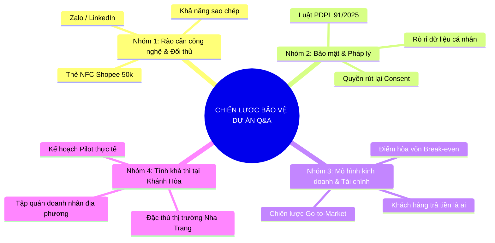

# BỘ CÂU HỎI & TRẢ LỜI PHẢN BIỆN (Q&A DEFENSE KIT) — DỰ ÁN ONE CONNECT NETWORK
## CUỘC THI KHỞI NGHIỆP ĐỔI MỚI SÁNG TẠO TỈNH KHÁNH HÒA 2026

**Đề tài:** Nền Tảng Định Danh Số & Quản Trị Giao Thương B2B Ứng Dụng Trí Tuệ Nhân Tạo (AI Matchmaking) Tích Hợp IoT Bảo Mật Theo Chuẩn Luật Dữ Liệu Cá Nhân 91/2025/QH15  
**Đại diện trả lời:** Hồ Hoàng Long (Johnny Long Hồ) — Sáng lập & Trưởng dự án  

---

---

## PHẦN 1: NHÓM CÂU HỎI VỀ CÔNG NGHỆ & RÀO CẢN CẠNH TRANH (DEFENSIBILITY)

### ❓ CÂU HỎI 1 (Câu hỏi kinh điển của BGK):
> *"Trên thị trường hiện nay có rất nhiều thẻ danh thiếp điện tử NFC bán trên Shopee/Tiktok với giá chỉ 50.000đ – 100.000đ. Tại sao One Connect lại định giá cao hơn và điểm khác biệt cốt lõi là gì?"*

#### 🎯 Kịch bản Trả lời Sắc bén (30 – 45 giây):
> *"Kính thưa Ban Giám khảo, sự khác nhau giữa thẻ NFC Shopee và One Connect giống như sự khác nhau giữa **một chiếc USB trắng** và **một nền tảng phần mềm đám mây SaaS**.*  
> 
> *1. **Thẻ NFC Shopee:** Chỉ là một đường link tĩnh (URL redirect). Ai quét cũng xem được toàn bộ SĐT/Email cá nhân mà không cần xin phép → Vi phạm trực tiếp Luật Dữ liệu Cá nhân 91/2025. Nếu người dùng đổi công ty hay mất thẻ, họ phải bỏ thẻ đó và mất 100% mối quan hệ.*  
> *2. **One Connect Network:** Là một **Hạ tầng phần mềm định danh & quản trị B2B (Pre-CRM)**:*
> - *Có cơ chế bảo vệ 2 chiều **Explicit 2-Way Consent** (chỉ hiện SĐT khi 2 bên đồng ý).*
> - *Tích hợp **AI Matchmaking** tự động xếp bàn đàm phán 1:1 trong sự kiện MICE.*
> - *Hỗ trợ **Card Continuity** (đổi thẻ mới 100% giữ nguyên dữ liệu, đối tác đổi chức vụ danh bạ tự cập nhật).*  
> *Khách hàng không mua một chiếc thẻ nhựa, họ đang mua **Hệ thống Quản trị & Mở rộng Mối quan hệ Doanh nghiệp**."*

---

### ❓ CÂU HỎI 2:
> *"Tại sao doanh nhân không dùng Zalo hoặc LinkedIn quét mã QR để kết bạn cho nhanh mà phải dùng One Connect?"*

#### 🎯 Kịch bản Trả lời:
> *"Zalo và LinkedIn là các mạng xã hội tuyệt vời, nhưng gặp phải **3 điểm nghẽn lớn trong giao thương B2B**:*  
> *1. **Ranh giới công việc & đời tư:** Nhiều doanh nhân và lãnh đạo không muốn chia sẻ tài khoản cá nhân Zalo/Facebook (vốn có hình ảnh gia đình, đời sống riêng) cho một đối tác mới gặp 30 giây ở hội trường.*  
> *2. **Nghịch lý Dunbar 150:** Sau 30 ngày tham gia hội nghị, Zalo lưu hàng trăm người mang tên 'Anh Hùng BĐS', 'Chị Lan Du Lịch' nhưng bạn hoàn toàn quên bối cảnh đã gặp ở đâu, họ đang cần tìm nguồn hàng gì. One Connect tự động lưu vết sự kiện, số bàn VIP và nhu cầu Cung - Cầu.*  
> *3. **Không tích hợp nghiệp vụ MICE:** Zalo không thể giúp Ban tổ chức check-in đại biểu dưới 1 giây và phân bổ số bàn giao thương 1:1 như One Connect."*

---

### ❓ CÂU HỎI 3:
> *"Thuật toán AI Matchmaking của One Connect hoạt động như thế nào? Có thật sự hiệu quả hay chỉ là gắn mác AI?"*

#### 🎯 Kịch bản Trả lời:
> *"Thuật toán AI Matchmaking của chúng tôi giải quyết bài toán ghép cặp nhị phân đa tiêu chí (Multi-criteria B2B Matching):*  
> *1. **Phân tích ngữ nghĩa (Semantic Embedding):** Khi doanh nghiệp nhập thông tin hồ sơ (Ví dụ: 'Cung cấp hải sản đông lạnh chuẩn HACCP' và 'Cần tìm nguồn thực phẩm cho chuỗi 5 khách sạn 5 sao Nha Trang'), AI sẽ phân tích từ khóa và nhu cầu thực tế thay vì chỉ so khớp ngành nghề chung chung.*  
> *2. **Tối ưu hóa lịch hẹn (Slot Optimization):** Thuật toán tự động giải bài toán phân bổ ma trận lịch hẹn 1:1 theo các khung giờ 15 phút, tránh trùng lịch và tối đa hóa xác suất ký kết hợp đồng.*  
> *3. **Hệ thống đã chạy thực tế:** Ban Giám khảo có thể truy cập ngay trang `/matching` trên bản Live để thấy hệ thống xếp bàn tự động trong 0.2 giây."*

---

## PHẦN 2: NHÓM CÂU HỎI VỀ BẢO MẬT & PHÁP LÝ (LEGAL & PDPL COMPLIANCE)

### ❓ CÂU HỎI 4:
> *"Dự án luôn nhấn mạnh việc tuân thủ Luật Bảo vệ Dữ liệu Cá nhân 91/2025/QH15. Cụ thể One Connect triển khai kỹ thuật như thế nào để đảm bảo tuân thủ?"*

#### 🎯 Kịch bản Trả lời:
> *"Chúng tôi tuân thủ Luật 91/2025 thông qua 3 trụ cột kỹ thuật:*  
> *1. **Quyền được chấp thuận rõ ràng (Explicit Consent - Điều 9, 11):** SĐT, Email và thông tin nhạy cảm mặc định ở trạng thái mã hóa (Masked). Chỉ khi bên A bấm gửi yêu cầu và bên B bấm chấp thuận trên giao diện, luồng dữ liệu mới được giải mã.*  
> *2. **Nhật ký truy cập bất biến (Audit Trail):** Mọi hành vi xem hồ sơ, trao đổi danh bạ đều được ghi nhận dấu vết thời gian (Timestamp), mã định danh (UUID) và IP vào cơ sở dữ liệu để phục vụ kiểm toán an toàn thông tin.*  
> *3. **Quyền rút lại sự đồng ý (Right to Withdraw):** Người dùng có quyền ngắt kết nối bất kỳ lúc nào; khi đó thông tin liên lạc trên danh bạ số của đối tác sẽ lập tức bị thu hồi quyền truy cập."*

---

## PHẦN 3: NHÓM CÂU HỎI VỀ TÀI CHÍNH & MÔ HÌNH KINH DOANH (BUSINESS & TRACTION)

### ❓ CÂU HỎI 5:
> *"Khách hàng mục tiêu sẵn sàng trả tiền nhiều nhất cho One Connect là ai? Doanh thu đến từ đâu?"*

#### 🎯 Kịch bản Trả lời:
> *"Chúng tôi có 2 phân khúc khách hàng B2B cốt lõi mang lại dòng tiền ngay lập tức:*  
> *1. **Ban Tổ Chức Sự Kiện MICE & Khách Sạn (Event Organizers):** Trả tiền cho Gói Số Hóa Sự Kiện (15 – 45 triệu VNĐ/sự kiện). Họ sẵn sàng chi trả vì One Connect giúp họ cắt giảm 70% chi phí in ấn thẻ đeo/vé giấy và tăng uy tín công nghệ của hội nghị.*  
> *2. **Doanh Nghiệp & Hiệp Hội Doanh Nhân (Corporate & Associations):** Mua phôi thẻ NFC Kim loại cao cấp (350k – 850k/thẻ) kèm thuê bao phần mềm SaaS quản lý đội ngũ kinh doanh (99k/user/tháng).*  
> *Điểm hòa vốn (Break-even point) của dự án đạt được khi triển khai 12 sự kiện MICE và 1.200 người dùng thường xuyên."*

---

### ❓ CÂU HỎI 6:
> *"Số tiền gọi vốn $30,000 – $50,000 sẽ được sử dụng vào những hạng mục cụ thể nào?"*

#### 🎯 Kịch bản Trả lời:
> *"Nguồn vốn kêu gọi sẽ được phân bổ chặt chẽ theo tỷ lệ 40 - 35 - 25 trong 12 tháng tới:*  
> *1. **40% ($16,000 - $20,000) — Nghiên cứu & Sản xuất Phần cứng:** Nhập khẩu phôi thẻ kim loại khắc laser cao cấp, đầu đọc RFID/NFC công nghiệp cho các trạm check-in.*  
> *2. **35% ($14,000 - $17,500) — Hạ tầng Đám mây & AI:** Mở rộng máy chủ Cloudflare Edge, chi phí API mô hình AI Matchmaking và chứng nhận bảo mật thông tin.*  
> *3. **25% ($10,000 - $12,500) — Marketing & Triển khai Pilot:** Tài trợ triển khai miễn phí cho 5 sự kiện của Hiệp hội Doanh nhân Trẻ Khánh Hòa để tạo hiệu ứng mạng lưới (Network Effect)."*

---

## PHẦN 4: NHÓM CÂU HỎI VỀ TÍNH KHẢ THI TẠI KHÁNH HÒA

### ❓ CÂU HỎI 7:
> *"Tại sao One Connect lại chọn Khánh Hòa làm điểm xuất phát mà không phải Hà Nội hay TP.HCM?"*

#### 🎯 Kịch bản Trả lời:
> *"Khánh Hòa có 3 lợi thế chiến lược hoàn hảo cho One Connect:*  
> *1. **Thủ phủ MICE & Du lịch:** Với hơn 300 sự kiện, hội nghị xúc tiến đầu tư quốc tế mỗi năm tại Nha Trang, mật độ giao thương doanh nghiệp là cực kỳ dày đặc.*  
> *2. **Môi trường thử nghiệm (Sandbox) lý tưởng:** Quy mô 14.000 doanh nghiệp với sự liên kết chặt chẽ trong Hội Doanh nhân Trẻ (YBA), Hiệp hội Du lịch (KTA) giúp chúng tôi dễ dàng tiếp cận và phủ sóng sản phẩm với chi phí truyền thông thấp nhất.*  
> *3. **Đúng định hướng Nghị quyết 09-NQ/TW của Bộ Chính trị:** Đưa Khánh Hòa trở thành thành phố trực thuộc Trung ương, đô thị thông minh và trung tâm dịch vụ đẳng cấp quốc tế."*
