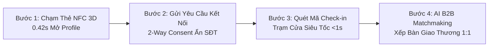

# KỊCH BẢN LIVE DEMO THỰC ĐỊA & KẾ HOẠCH TRIỂN KHAI PILOT
## DỰ ÁN ONE CONNECT NETWORK — KHÁNH HÒA 2026

**Đề tài:** Nền Tảng Định Danh Số & Quản Trị Giao Thương B2B Ứng Dụng Trí Tuệ Nhân Tạo (AI Matchmaking) Tích Hợp IoT Bảo Mật Theo Chuẩn Luật PDPL 91/2025  
**Mục tiêu:** Hướng dẫn từng bước thao tác thực tế (Live Demo) trong 60 – 90 giây khi đứng trước Ban Giám khảo và kế hoạch tổ chức sự kiện thí điểm 500 đại biểu tại Nha Trang.

---

---

## PHẦN 1: KỊCH BẢN THAO TÁC LIVE DEMO TRƯỚC BAN GIÁM KHẢO (60 – 90 GIÂY)

Khi trình bày đến **Slide 4 (Product MVP)**, bạn mở song song trình duyệt web [https://one-connect-network.vercel.app/demo](https://one-connect-network.vercel.app/demo) và cầm trên tay phôi thẻ NFC kim loại.

---

### ⏱️ GIÂY 00 – 20: TRÌNH DIỄN THẺ DOANH NHÂN 3D & CHẠM NFC
* **Hành động:** 
  1. Giơ thẻ NFC kim loại lên và áp vào mặt lưng iPhone/Android.
  2. Màn hình điện thoại lập tức bật mở trang: `https://one-connect-network.vercel.app/p/hoanglong`.
  3. Rê chuột trên giao diện để thẻ 3D xoay phản chiếu ánh kim loại.
* **Lời nói:** 
  > *"Kính thưa Ban Giám khảo, chỉ với một chạm NFC 0.42 giây — không cần tải bất kỳ ứng dụng nào — toàn bộ hồ sơ số 3D, danh thiếp chuẩn quốc tế vCard 3.0 và catalogue sản phẩm của tôi đã hiển thị mượt mà trên điện thoại của đối tác."*

---

### ⏱️ GIÂY 20 – 40: TRÌNH DIỄN BẢO MẬT 2 CHIỀU (2-WAY CONSENT - LUẬT 91/2025)
* **Hành động:** 
  1. Chỉ vào phần SĐT và Email trên màn hình: Hiện ký tự mã hóa `098***789` và biểu tượng ổ khóa bảo vệ 🛡️.
  2. Bấm nút **"Gửi Lời Mời Kết Nối"** → Hệ thống gửi thông báo yêu cầu xác nhận.
* **Lời nói:** 
  > *"Khác với các loại thẻ NFC trôi nổi trên thị trường làm lộ SĐT gây phiền toái telesale rác, One Connect tuân thủ nghiêm ngặt Luật Bảo vệ Dữ liệu Cá nhân số 91/2025. SĐT cá nhân mặc định bị ẩn. Chỉ khi đối tác bấm 'Đồng ý', danh bạ mới được giải mã và lưu thẳng vào máy."*

---

### ⏱️ GIÂY 40 – 60: TRÌNH DIỄN TRẠM CHECK-IN SỰ KIỆN MICE (<1 GIÂY)
* **Hành động:** 
  1. Chuyển sang tab **[Trạm Check-in Hội Nghị](https://one-connect-network.vercel.app/operator/checkin)**.
  2. Đưa mã QR hoặc chạm thẻ vào trạm → Màn hình hiện hiệu ứng xanh lá: **"ĐIỂM DANH THÀNH CÔNG: ĐẠI BIỂU VIP — HỒ HOÀNG LONG — BÀN A12"**.
  3. Âm thanh bíp vang lên trong 0.5 giây.
* **Lời nói:** 
  > *"Tại các hội nghị MICE hàng nghìn người, trạm check-in thông minh của chúng tôi nhận diện và phân luồng đại biểu VIP trong chưa đầy 1 giây, loại bỏ hoàn toàn cảnh xếp hàng ùn tắc hay vé giấy giả mạo."*

---

### ⏱️ GIÂY 60 – 80: TRÌNH DIỄN THUẬT TOÁN AI B2B MATCHMAKING
* **Hành động:** 
  1. Mở tab **[AI B2B Matchmaking](https://one-connect-network.vercel.app/matching)**.
  2. Bấm nút **"Chạy Thuật Toán Ghép Cặp AI"** → Hệ thống tự động phân tích ma trận Cung - Cầu và xếp các cặp doanh nghiệp vào từng số bàn đàm phán 1:1 với chỉ số tương thích (Match Score 94%).
* **Lời nói:** 
  > *"Và đây là trái tim công nghệ của dự án: Trí tuệ Nhân tạo AI tự động đối soát năng lực giữa doanh nghiệp Cung cấp và bên Cần mua, tự động xếp lịch hẹn đàm phán 1:1 tại các bàn VIP, biến mỗi hội nghị thành nơi phát sinh hợp đồng kinh tế thực chất!"*

---

## PHẦN 2: KẾ HOẠCH TRIỂN KHAI SỰ KIỆN THÍ ĐIỂM (PILOT EVENT ROADMAP)

### 🎯 Sự kiện mục tiêu: **"Diễn Đàn Kết Nối Giao Thương Doanh Nhân Trẻ Khánh Hòa 2026"**
* **Quy mô:** 300 – 500 Đại biểu Doanh nhân & Lãnh đạo Sở Ban Ngành.
* **Địa điểm:** Khách sạn Mường Thanh Luxury / Vinpearl Nha Trang.

| Thời Gian | Hạng Mục Công Việc | Kết Quả Bàn Giao |
| :--- | :--- | :--- |
| **Tuần T - 3** | Khởi tạo cổng đăng ký Online trên One Connect | Thu thập hồ sơ năng lực & nhu cầu Cung - Cầu của 500 đại biểu. |
| **Tuần T - 2** | AI Matchmaking chạy đối soát trước sự kiện | Sinh trước 150 lịch hẹn đàm phán 1:1 gửi qua SMS/Email đại biểu. |
| **Tuần T - 1** | Khắc laser 500 Thẻ Doanh Nhân NFC Kim Loại & Nhựa | Kiểm thử nạp dữ liệu thẻ (NFC Encoding) đạt tốc độ 100%. |
| **Ngày Sự Kiện (T)** | Vận hành 2 Trạm Check-in Cửa & Màn hình Live Matching | Tốc độ check-in trung bình **0.65s/người**, không ùn tắc. |
| **Tuần T + 1** | Xuất Báo Cáo Đo Lường Hiệu Quả Giao Thương (ROI) | Báo cáo chi tiết số lượt chạm, số kết nối thành công cho Ban Tổ Chức. |

---

## PHẦN 3: CHECKLIST CHUẨN BỊ THIẾT BỊ CHO NGÀY PITCHING

* [ ] **1 Laptop chính:** Mở sẵn các tab Chrome gồm: Slide thuyết trình (`One_Connect_Pitching_Deck_Slides.html`), Tab Live Demo Hub (`/demo`), Tab Check-in (`/operator/checkin`), Tab Matchmaking (`/matching`).
* [ ] **1 Điện thoại iPhone hoặc Android có bật NFC:** Đã đăng nhập tài khoản đại biểu để sẵn sàng chạm thử.
* [ ] **Phôi thẻ mẫu trên tay:** Ít nhất 2 chiếc thẻ kim loại khắc laser thương hiệu ONE CONNECT để đưa trực tiếp cho Ban Giám khảo cầm thử và trải nghiệm độ đầm tay cao cấp.
* [ ] **Bộ phát Wifi / 4G dự phòng:** Đảm bảo đường truyền internet ổn định tuyệt đối trong suốt thời gian pitching.
