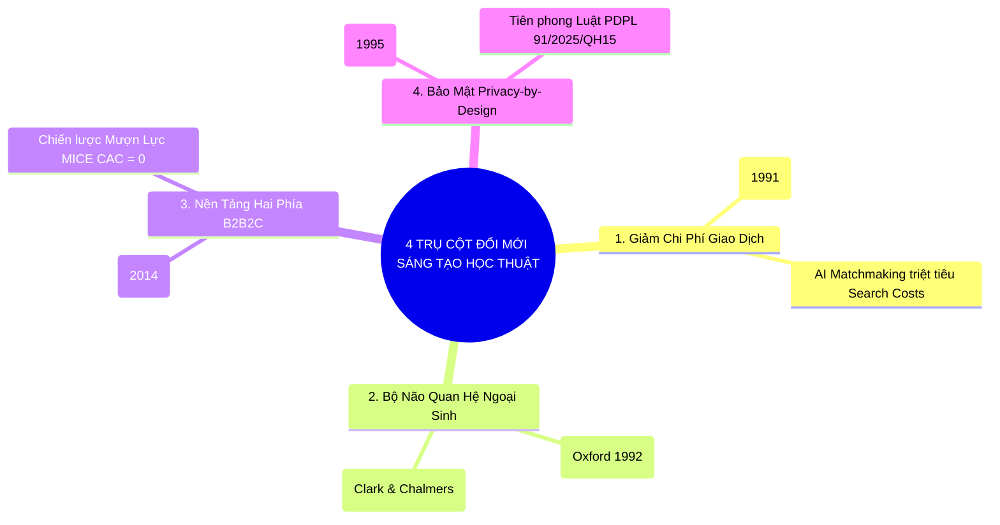
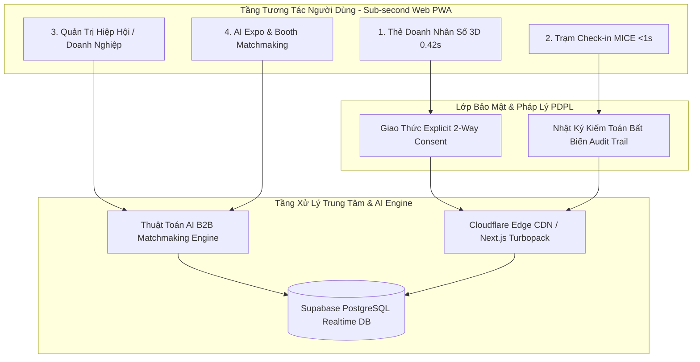

# BẢN THUYẾT MINH DỰ ÁN KHỞI NGHIỆP ĐỔI MỚI SÁNG TẠO TỈNH KHÁNH HÒA 2026

> [!IMPORTANT]
> **Cuộc thi:** Khởi nghiệp Đổi mới Sáng tạo tỉnh Khánh Hòa – Năm 2026  
> **Chủ đề:** *"Khởi nghiệp sáng tạo Khánh Hòa – Giải quyết những vấn đề của thực tiễn"*  
> **Cơ quan chủ trì:** Sở Khoa học và Công nghệ tỉnh Khánh Hòa  
> **Đơn vị dự thi:** Aplusvn Media & Tech (TP. Nha Trang, Khánh Hòa)  
> **Cổng thông tin dự thi:** [innokhanhhoa.vn](https://innokhanhhoa.vn)

> [!NOTE]
> **Định vị công nghệ:** Nền tảng Định danh Doanh nghiệp & Quản trị Giao thương B2B ứng dụng Trí tuệ Nhân tạo (AI Matchmaking & Smart Expo Router), tích hợp hạ tầng IoT không chạm và giao thức bảo mật dữ liệu hai chiều tuân thủ nghiêm ngặt **Luật Bảo vệ Dữ liệu Cá nhân số 91/2025/QH15**.

---

## 📌 THÔNG TIN TỔNG QUAN VỀ DỰ ÁN

| Hạng mục | Nội dung chi tiết |
|---|---|
| **Tên dự án / Đề tài** | **ONE CONNECT NETWORK — Nền Tảng Định Danh Số & Quản Trị Giao Thương B2B Ứng Dụng Trí Tuệ Nhân Tạo (AI Matchmaking) Tích Hợp IoT Bảo Mật Theo Chuẩn Luật PDPL 91/2025** |
| **Tên tiếng Anh** | *AI-Powered B2B Smart Identity & Matchmaking Infrastructure* |
| **Lĩnh vực tham gia** | Chuyển đổi số, Công nghệ thông tin & Viễn thông, Đổi mới sáng tạo trong Du lịch MICE, Hội chợ Triển lãm Expo & Dịch vụ Doanh nghiệp B2B |
| **Tác giả / Trưởng dự án** | Hồ Hoàng Long (Johnny Long Hồ) — Sáng lập kiêm Quản lý Dự án (Aplusvn Media & Tech) |
| **Email liên hệ** | `contact.johnnylongho@gmail.com` / `johnny@aplusvn.com` |
| **Điện thoại** | 0903.888.999 |
| **Trạng thái công nghệ** | Đạt cấp độ **TRL-7 (Hoàn thiện 100% bản MVP v1.0 hoạt động thực tế trên Production)** |
| **Đường dẫn Web Live** | [https://one-connect-network.vercel.app/](https://one-connect-network.vercel.app/) |
| **Trung tâm Live Demo Hub** | [https://one-connect-network.vercel.app/demo](https://one-connect-network.vercel.app/demo) |
| **Mã nguồn dự án (GitHub)** | [https://github.com/johnnylongho/one-connect](https://github.com/johnnylongho/one-connect) |

---

## 1. TÍNH CẤP THIẾT & BÀI TOÁN THỰC TIỄN TẠI TỈNH KHÁNH HÒA

### 1.1. Bối cảnh chiến lược của tỉnh Khánh Hòa
* Tỉnh Khánh Hòa đang trên lộ trình phát triển thành **Thành phố trực thuộc Trung ương**, trung tâm kinh tế biển, trung tâm du lịch - dịch vụ chất lượng cao và trung tâm đổi mới sáng tạo của vùng Duyên hải Nam Trung Bộ theo **Nghị quyết số 09-NQ/TW của Bộ Chính trị**.
* TP. Nha Trang và tỉnh Khánh Hòa là **thủ phủ du lịch MICE & Hội chợ Triển lãm (Hội nghị, Hội thảo, Triển lãm Expo)**, quy tụ hơn **300 sự kiện, diễn đàn xúc tiến đầu tư và TECHFEST hàng năm**, thu hút hàng vạn lượt doanh nhân, nhà đầu tư, hiệp hội doanh nghiệp trong nước và quốc tế.

### 1.2. Ba "Điểm Nghẽn" (Pain Points) Lớn Cần Giải Quyết
1. **Lãng phí in ấn & Rác thải carbon (Trái định hướng Kinh tế Xanh):**
   * Hơn **88% danh thiếp giấy bị vứt bỏ** trong vòng 7 ngày đầu tiên sau sự kiện. Các hội nghị MICE và gian hàng hội chợ tiêu tốn hàng trăm triệu đồng cho chi phí in ấn thẻ đeo, catalogue và tờ rơi quảng cáo.
2. **Nghịch lý Giới hạn Nhận thức 150 (Dunbar's Number Paradox):**
   * Theo nghiên cứu của **Giáo sư Robin Dunbar (Đại học Oxford)**, não người chỉ có khả năng duy trì tối đa **150 mối quan hệ**. Trong khi đó, một doanh nhân tiếp xúc với **1.000 – 3.000 đối tác/năm**, dẫn đến **hơn 70% đối tác trở thành "danh bạ chết"** sau 30 ngày vì lãng quên bối cảnh gặp gỡ (Lead Decay).
3. **Nguy cơ vi phạm pháp luật về Dữ liệu Cá nhân (Luật PDPL Số 91/2025/QH15):**
   * Các hội nghị hiện nay thu thập và chia sẻ danh sách SĐT/Email đại biểu tràn lan, không có cơ chế **Đồng ý Tự nguyện (Explicit Consent)**, gây vấn nạn telesale rác và khiến doanh nghiệp đối mặt với mức phạt lên tới **5% tổng doanh thu**.

---

## 2. CƠ SỞ KHOA HỌC & TÍNH ĐỔI MỚI SÁNG TẠO ĐỘT PHÁ (ACADEMIC GROUNDING)

Tính ĐMST của One Connect được chuẩn hóa theo **Khung tiêu chuẩn OECD Oslo Manual** và giải quyết bài toán thực tiễn dựa trên **4 lý thuyết khoa học đạt giải Nobel**:

### 2.1. Đổi mới Quy trình: Cắt giảm triệt để Chi phí Giao dịch (Transaction Cost Innovation)
* **Cơ sở học thuật:** Lý thuyết Chi phí Giao dịch của **Giáo sư Ronald Coase (Giải Nobel Kinh tế năm 1991)** và **Oliver Williamson (Nobel 2009)**.
* **Đột phá của One Connect:** Trong các sự kiện truyền thống, doanh nhân mất hàng giờ tìm kiếm đối tác mù mờ (Search Costs rất cao). One Connect ứng dụng **Thuật toán AI Matchmaking** và **Web PWA chạm 0.42s** để tự động đối soát Cung - Cầu và phân bổ số bàn đàm phán 1:1, **cắt giảm chi phí tìm kiếm từ hàng giờ xuống 0 giây**.

### 2.2. Đổi mới Nhận thức: Bộ Não Mở Rộng Vượt Giới Hạn Sinh Học (Cognitive Augmentation)
* **Cơ sở học thuật:** Công trình về chỉ số 150 mối quan hệ của **Prof. Robin Dunbar (Đại học Oxford, 1992)** và Thuyết Bộ Não Mở Rộng (*The Extended Mind Thesis*) của **Andy Clark & David Chalmers (1998, Oxford)**.
* **Đột phá của One Connect:** Xây dựng tầng hạ tầng **"Bộ Não Quan Hệ Ngoại Sinh" (Pre-CRM Context Memory)** tự động lưu vết ngày gặp, sự kiện, số bàn VIP và nhu cầu đối tác $\rightarrow$ **Giải phóng năng lực nhận thức của doanh nhân từ 150 lên hơn 5.000 mối quan hệ sống động**, xóa bỏ hoàn toàn hiện tượng "danh bạ chết".

### 2.3. Đổi mới Mô hình Kinh doanh: Nền Tảng Hai Phía B2B2C (Two-Sided Platform Innovation)
* **Cơ sở học thuật:** Lý thuyết Thị trường Nền tảng Hai Phía của **Giáo sư Jean Tirole (Giải Nobel Kinh tế năm 2014)** (*Rochet & Tirole, 2003*).
* **Đột phá của One Connect:** Thoát khỏi "cái bẫy bán phần cứng thẻ nhựa 1 lần" (Hardware Trap). One Connect áp dụng **Mô hình Nền tảng B2B2C "Mượn Lực MICE"**: Cung cấp gói số hóa cho Ban Tổ Chức sự kiện và Khách sạn MICE để onboard cùng lúc hàng nghìn đại biểu với **Chi phí Thu hút Khách hàng (CAC) xấp xỉ bằng 0**.

### 2.4. Đổi mới Pháp lý: Bảo Mật Quyền Riêng Tư Theo Thiết Kế (Privacy-by-Design)
* **Cơ sở học thuật & Pháp lý:** Khung nguyên tắc *Privacy by Design* của **Tiến sĩ Ann Cavoukian (1995)** và **Luật Bảo vệ Dữ liệu Cá nhân số 91/2025/QH15**.
* **Đột phá của One Connect:** Tiên phong cơ chế **Explicit 2-Way Consent Protocol** (ẩn mặc định SĐT/Email, chỉ giải mã khi cả 2 bên cùng chấp thuận) kèm **Nhật ký kiểm toán bất biến (Audit Trail)** bảo vệ doanh nghiệp trước mức phạt 5% doanh thu.

---

## 3. MỤC TIÊU & CHỈ TIÊU ĐỊNH LƯỢNG CỦA DỰ ÁN

### 3.1. Mục tiêu tổng quát
Xây dựng nền tảng hạ tầng số (Relationship Infrastructure Layer & Pre-CRM) kết nối định danh doanh nhân, tổ chức Hiệp hội/CLB và số hóa các sự kiện MICE/Triển lãm Expo tại tỉnh Khánh Hòa với ma sát bằng 0 (Zero Friction), ứng dụng Trí tuệ Nhân tạo (AI Matchmaking) tối ưu hóa giao thương và bảo vệ dữ liệu cá nhân theo chuẩn quốc tế.

### 3.2. Các chỉ tiêu định lượng cụ thể
1. **Tốc độ chạm NFC:** Thời gian phản hồi mở hồ sơ số dưới **0.42 giây**, tương thích 100% điện thoại iPhone & Android qua Web PWA không cần cài app.
2. **Tốc độ check-in hội nghị:** Điểm danh và phân luồng đại biểu VIP dưới **0.8 giây/lượt**.
3. **Hiệu quả ghép cặp AI:** Tự động xếp lịch đàm phán 1:1 và điều phối lộ trình tham quan gian hàng triển lãm trong **chưa đầy 1 giây** với độ chính xác nhu cầu đạt trên **90%**.
4. **Tiết kiệm chi phí:** Cắt giảm tối thiểu **85% chi phí in ấn thẻ giấy, vé mời và catalogue tài liệu**.
5. **Tuân thủ pháp lý:** 100% kết nối số tuân thủ giao thức **Explicit 2-Way Consent** theo Luật 91/2025/QH15.

---

## 4. HỆ SINH THÁI 5 PHÂN HỆ LÕI (TRL-7 LIVE PLATFORM)

* **Phân hệ 1 — Thẻ Doanh Nhân Số 3D (IoT Smart Identity):** 4 phôi kim loại sang trọng (Obsidian, Sapphire, Gold, Emerald) lật 3D tương tác + mã QR vCard 3.0.
* **Phân hệ 2 — Quản Trị Hiệp Hội & Doanh Nghiệp (ADM-ORG):** Cấp phát thẻ số tập trung, phân quyền Ban Chấp Hành, quản lý danh bạ hội viên.
* **Phân hệ 3 — Trạm Check-in Sự Kiện Siêu Tốc (<1s):** Điểm danh đại biểu không chạm, in vé thẻ, phân luồng khách VIP tự động.
* **Phân hệ 4 — AI B2B Matchmaking 1:1:** Phân tích nhu cầu giao thương và tự động xếp số bàn đàm phán 1:1.
* **Phân hệ 5 — AI Smart Expo & Booth Matchmaking:** Gợi ý lộ trình tham quan gian hàng thông minh (Smart Expo Tour), chạm thẻ nhận catalogue 3D không giấy tại quầy, và đặt lịch đàm phán 1:1 tại Bàn VIP gian hàng.

---

## 5. MÔ HÌNH KINH DOANH & LỘ TRÌNH NATIVE APP (PLG SAAS)

### 5.1. Bốn Dòng Doanh Thu Đa Tầng Bền Vững:
1. **Dòng 1: Bán Phôi Thẻ Kim Loại Cao Cấp:** 350.000đ – 850.000đ / thẻ (Biên lợi nhuận 65%).
2. **Dòng 2: Gói Số Hóa Sự Kiện MICE & Triển Lãm Expo:** 15.000.000đ – 45.000.000đ / sự kiện và 50M – 150M / hội chợ triển lãm (Biên lợi nhuận 75%).
3. **Dòng 3: Thuê Bao B2B SaaS Doanh Nghiệp:** 99.000đ / user / tháng (Biên lợi nhuận 85%).
4. **Dòng 4: Phí Hoa Hồng Matching Premium:** 1% – 3% giá trị hợp đồng giao thương thành công.

### 5.2. Lộ Trình Phát Triển Mobile App (Mô Hình Zoom, Netflix, Canva):
* **Giai đoạn 1 (Hiện tại): Web PWA Sub-second (0.42s)** $\rightarrow$ Đạt tỷ lệ tiếp cận 100% không ma sát tại các sự kiện MICE.
* **Giai đoạn 2 (Khi đạt 20.000+ Active Users): Ra mắt Native App trên iOS & Google Play Store** $\rightarrow$ Áp dụng mô hình **Product-Led Growth (PLG) Freemium**:
  - *Gói Free:* 1 thẻ số, lưu danh bạ cơ bản.
  - *Gói Pro (99k/tháng):* Mở khóa 3D thẻ kim loại, Trợ lý AI Live Voice hỗ trợ đàm phán, tích hợp Apple/Google Wallet.
  - *Gói Enterprise (Canva Teams):* Quản trị toàn bộ dữ liệu quan hệ của đội ngũ kinh doanh.

---

## 6. MA TRẬN LỢI THẾ CẠNH TRANH & 4 CON HÀO PHÒNG THỦ (THE 4 MOATS)

| Tiêu Chí So Sánh | Danh Thiếp Giấy Truyền Thống | Thẻ NFC Shopee / Đời Cũ | ONE CONNECT NETWORK |
|---|---|---|---|
| **Bảo Mật Luật PDPL 91/2025** | Không có cơ chế bảo vệ | Lộ SĐT cá nhân / Dễ bị spam | **2-Way Consent Độc Quyền (Ẩn SĐT)** |
| **Ứng Dụng Trí Tuệ Nhân Tạo** | Không có | Không có | **Thuật toán AI Ghép Bàn & Gian Hàng 1:1** |
| **Trạm Check-in Sự Kiện MICE** | Ghi sổ tay / Thủ công | Không hỗ trợ | **Tích hợp sẵn <1 giây / Phân luồng VIP** |
| **Bộ Nhớ Bối Cảnh (Pre-CRM)** | Quên sau 7 ngày | Không lưu được bối cảnh | **Tự động lưu ngày gặp, sự kiện, nhu cầu** |
| **Bảo Toàn Dữ Liệu Khi Đổi Thẻ** | Phải vứt bỏ và in lại | Phải cài đặt thủ công | **Card Continuity: 100% Giữ nguyên dữ liệu** |

---

## 7. MỐI QUAN HỆ CỘNG SINH VỚI HỆ THỐNG ĐỊNH DANH QUỐC GIA VNeID

* **VNeID (Bộ Công An / Đề Án 06):** Là **Định danh Pháp lý Công dân (G2C)** phục vụ quản lý nhà nước, dịch vụ công, tư pháp, bảo mật tuyệt đối dữ liệu đời tư.
* **One Connect:** Là **Định danh Thương mại & Giao thương (B2B Pre-CRM)** phục vụ xúc tiến kinh doanh, chia sẻ Catalogue 3D, kết nối Cung - Cầu và điểm danh sự kiện MICE.
* **Tích hợp tương lai:** One Connect kết nối API mở VNeID để gắn **Tích Xanh Doanh Nhân Xác Thực (Level 2 Verified Badge)**, loại bỏ 100% tình trạng giám đốc ảo và lừa đảo thương mại.

---

## 8. ĐỀ XUẤT ĐẶT HÀNG NHIỆM VỤ KH,CN & ĐMST CẤP TỈNH / QUỸ NAFOSTED (DỰ TOÁN 10 – 25 TỶ)

Dự án đáp ứng đầy đủ tiêu chí của **Nghị định số 267/2025/NĐ-CP & Thông tư 44/2025/TT-BKHCN**:

* **Tên đề xuất nhiệm vụ:** *"Nghiên cứu, phát triển và ứng dụng nền tảng định danh số B2B tích hợp IoT và thuật toán Trí tuệ nhân tạo (AI Matchmaking) phục vụ chuyển đổi số kinh tế sự kiện MICE và xúc tiến thương mại liên vùng theo chuẩn an toàn dữ liệu số."*
* **Cơ chế tài chính 50/50:**
  - Vốn Ngân sách Nhà nước tài trợ: **50% (Tiền mặt giải ngân)**.
  - Vốn Đối ứng Doanh nghiệp: **50% (Quy đổi Tài sản trí tuệ IP, hạ tầng và nguồn thu dịch vụ)**.
  - Tối ưu hóa vận hành đảm bảo **lợi nhuận ròng trực tiếp 20% – 24%** trên nguồn vốn ngân sách cấp, tạo nền tảng thu phí SaaS bền vững hàng năm.

---

## 9. ĐỘI NGŨ SÁNG LẬP & KẾ HOẠCH TRIỂN KHAI PILOT

* **Đơn vị chủ trì:** Aplusvn Media & Tech (TP. Nha Trang, Khánh Hòa) — 8+ năm kinh nghiệm thực chiến về truyền thông số, sản xuất media và phần mềm IoT.
* **Chủ nhiệm dự án:** Hồ Hoàng Long (Johnny Long Hồ) — Sáng lập One Connect Network.
* **Kế hoạch gọi vốn hạt giống (Seed Round):** **$30,000 – $50,000** để mở rộng phôi thẻ kim loại và nâng cấp máy chủ AI.
* **Cam kết:** Tài trợ miễn phí 100% phần mềm số hóa cho các sự kiện của Tỉnh đoàn, Hội LHTN và Hội Doanh nhân Trẻ Khánh Hòa trong năm 2026.
