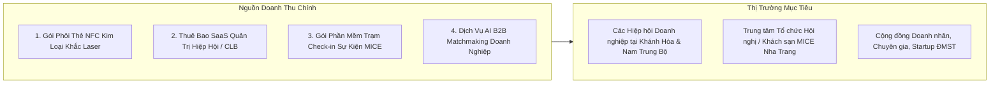

# BẢN THUYẾT MINH DỰ ÁN KHỞI NGHIỆP ĐỔI MỚI SÁNG TẠO TỈNH KHÁNH HÒA 2026

**Cuộc thi:** Khởi nghiệp Đổi mới Sáng tạo tỉnh Khánh Hòa – 2026  
**Chủ đề:** *"Khởi nghiệp sáng tạo Khánh Hòa – Giải quyết những vấn đề của thực tiễn"*  
**Cơ quan chủ trì:** Sở Khoa học và Công nghệ tỉnh Khánh Hòa  
**Trang thông tin chính thức:** [innokhanhhoa.vn](https://innokhanhhoa.vn)  

---

## THÔNG TIN TỔNG QUAN VỀ DỰ ÁN

| Hạng mục | Nội dung chi tiết |
|---|---|
| **Tên dự án / đề tài** | **Nền Tảng Hạ Tầng Định Danh Số (Business Identity) & Quản Trị Quan Hệ Giao Thương B2B Tích Hợp Thẻ Chạm NFC Không Ma Sát Tuân Thủ Luật Dữ Liệu Cá Nhân 91/2025/QH15 Cho Hệ Sinh Thái Doanh Nghiệp Khánh Hòa** |
| **Lĩnh vực tham gia** | Chuyển đổi số, Công nghệ Thông tin, Đổi mới sáng tạo trong Du lịch MICE & Dịch vụ B2B |
| **Bảng dự thi** | BẢNG DỰ ÁN KHỞI NGHIỆP ĐMST (Đã có sản phẩm MVP v1.0 hoạt động thực tế) |
| **Chủ nhiệm dự án** | HỒ HOÀNG LONG — Quản lý Dự án & Phát triển Sản phẩm |
| **Đơn vị công tác / Pháp nhân** | Công ty Cổ phần Tập đoàn Công nghệ số A+ (A PLUSVN) |
| **Địa chỉ liên hệ** | Tầng 8, Tòa nhà ASIA, 25 Lê Lợi, Nha Trang, Tỉnh Khánh Hòa |
| **Email liên hệ** | `contact.johnnylongho@gmail.com` |
| **Điện thoại** | 0794.677.369 |
| **Thành viên nhóm dự án** | 1. Hồ Hoàng Long (Quản lý dự án và phát triển sản phẩm) 2. Nguyễn Nhật Thanh (Trưởng phòng phát triển AI) 3. Trần Tuấn Kiệt (Định hướng kinh doanh) |
| **Trạng thái phát triển** | Đã hoàn thành bản MVP v1.0 hoạt động thực tế (Live Product) |
| **Đường dẫn sản phẩm Live** | [https://one-connect-network.vercel.app/](https://one-connect-network.vercel.app/) |
| **Mã nguồn dự án (GitHub)** | [https://github.com/johnnylongho/one-connect](https://github.com/johnnylongho/one-connect) |
| **Tình trạng sở hữu trí tuệ** | Chưa đăng ký (Đang hoàn thiện hồ sơ đăng ký tại Cục SHTT) |

---

## 1. TÍNH CẤP THIẾT & BÀI TOÁN THỰC TIỄN TẠI TỈNH KHÁNH HÒA

### 1.1. Bối cảnh đặc thù của tỉnh Khánh Hòa
* Tỉnh Khánh Hòa đang trên lộ trình phát triển thành **Thành phố trực thuộc Trung ương**, trung tâm kinh tế biển, khoa học công nghệ và đổi mới sáng tạo của vùng Duyên hải Nam Trung Bộ theo Nghị quyết 09-NQ/TW của Bộ Chính trị.
* TP. Nha Trang và tỉnh Khánh Hòa là **thủ phủ du lịch MICE (Hội nghị, Hội thảo, Triển lãm)**, xúc tiến thương mại, các diễn đàn liên kết vùng và TECHFEST hàng năm, quy tụ hàng vạn lượt doanh nhân, nhà đầu tư, hiệp hội doanh nghiệp trong nước và quốc tế.

### 1.2. Ba "Điểm Nghẽn" (Pain Points) Lớn Cần Giải Quyết:
1. **Lãng phí in ấn & Rác thải sự kiện (Trái với định hướng Chuyển đổi Xanh / Net-Zero):**
   * Mỗi sự kiện MICE in hàng chục ngàn danh thiếp giấy và tài liệu dùng một lần. Sau sự kiện, phần lớn tài liệu và danh thiếp bị thất lạc hoặc vứt bỏ do tính chất tĩnh và không cập nhật được, gây lãng phí ngân sách và phát sinh rác thải.
2. **Đứt gãy bối cảnh quan hệ sau sự kiện (Post-Event Relationship Gap):**
   * Doanh nhân gặp gỡ, trao đổi rất nhiều người tại sự kiện nhưng sau khi về thì không nhớ ai với ai, gặp trong bối cảnh nào, nhu cầu hợp tác Cung - Cầu là gì do thiếu công cụ *"Relationship Memory"* ghi nhớ và phân loại quan hệ.
3. **Thách thức Quản trị Dữ liệu & Quyền riêng tư (Luật PDPL Số 91/2025/QH15):**
   * Trong bối cảnh Luật Bảo vệ Dữ liệu Cá nhân 91/2025/QH15 và Nghị định 13/2023/NĐ-CP được thực thi, các hội nghị truyền thống thường thu thập và chia sẻ danh sách SĐT, Email đại biểu thủ công thiếu cơ chế **Đồng thuận 2 chiều (2-Way Consent)**, tiềm ẩn nhiều rủi ro về bảo mật thông tin.

---

## 2. MỤC TIÊU DỰ ÁN

* **Mục tiêu tổng quát:** Xây dựng nền tảng hạ tầng số (SaaS Pre-CRM & Relationship Layer) kết nối định danh doanh nhân, tổ chức Hội/CLB và các sự kiện MICE tại tỉnh Khánh Hòa với ma sát bằng 0 (Zero Friction), bảo vệ dữ liệu cá nhân theo chuẩn quốc tế.
* **Mục tiêu cụ thể:**
  1. Số hóa 100% danh thiếp và điểm danh sự kiện bằng **Thẻ kim loại NFC 1-chạm (0.42s) & Dynamic QR Code**.
  2. Triển khai thử nghiệm (Pilot) cho ít nhất **01 Hiệp hội / Sự kiện Doanh nhân quy mô 150 – 300 người tại Nha Trang** trong quý 4/2026.
  3. Tiết kiệm tối thiểu **85% chi phí in ấn danh thiếp/tài liệu** cho các đơn vị tham gia.
  4. 100% giao dịch kết nối tuân thủ cơ chế **Explicit 2-Way Consent** theo Luật PDPL 91/2025/QH15.

---

## 3. GIẢI PHÁP ĐỔI MỚI SÁNG TẠO & HẠ TẦNG CÔNG NGHỆ

### 3.1. Điểm mới & Đột phá công nghệ của ONE CONNECT
1. **Công nghệ Chạm NFC 1-Chạm Siêu Tốc (Sub-second Tap 0.42s):**
   * Tương thích 100% smartphone (Apple iOS qua CoreNFC và Android qua WebNFC), không bắt buộc người nhận phải tải ứng dụng phức tạp (kiến trúc Web PWA Mobile-First).
2. **Cơ chế Card Replacement Continuity (Bảo toàn dữ liệu khi đổi thẻ):**
   * UID thẻ chip NFC vật lý được thiết kế độc lập tại bảng CSDL `access_cards`. Khi doanh nhân đổi thẻ mới, toàn bộ danh bạ và ghi chú quan hệ **vẫn được bảo toàn trọn vẹn 100%**.
3. **Tiên phong Pháp lý 2-Way Consent (Luật PDPL 91/2025/QH15):**
   * Dữ liệu nhạy cảm (SĐT cá nhân, Email bảo mật) tự động che mờ (Data Masking) và chỉ mở khóa khi cả hai bên cùng nhấn chấp nhận kết nối.
4. **Quyền Chủ Quyền Dữ Liệu (Data Sovereignty):**
   * Tích hợp tính năng cho phép doanh nhân tự **Bật/Tắt hiển thị công khai hồ sơ**, **Xuất gói dữ liệu JSON (Điều 14 PDPL)** và **Xóa vĩnh viễn dữ liệu (Right to be Forgotten - Điều 16 PDPL)**.

### 3.2. Bốn Phân Hệ Cốt Lõi Đã Hoàn Thành Trên Bản Live:
* **Module 1 - Identity & Executive Cards:** Hồ sơ định danh doanh nhân 3D tương tác lật 2 mặt, thẻ NFC phôi Obsidian/Sapphire/Gold/Emerald, mã Dynamic QR đa dụng.
* **Module 2 - Organization & Membership:** Quản lý danh bạ hội viên Hiệp hội, phân quyền Ban chấp hành, quản lý hội phí và sinh hoạt Hội.
* **Module 3 - Event Fast Check-in (<0.5s):** Trạm điểm danh cửa sự kiện siêu tốc, tự động nhận diện đại biểu, chống quét lặp Idempotent.
* **Module 4 - Networking & Relationship Memory:** Kết nối có consent 2 chiều, ghi chú riêng tư (Private Notes) và gắn nhãn tiềm năng Lead Follow-up.

---

## 4. MÔ HÌNH KINH DOANH & KHẢ NĂNG THƯƠNG MẠI HÓA (LEAN CANVAS)

### 4.1. Khách hàng mục tiêu:
1. **Khách hàng B2B Tổ chức:** Hiệp hội Doanh nhân Trẻ Khánh Hòa, Hội Doanh nhân Nữ, Hiệp hội Du lịch Nha Trang - Khánh Hòa, các Ban Quản lý Khu kinh tế/Khu công nghiệp.
2. **Khách hàng Doanh nghiệp Sự kiện / MICE:** Khách sạn 5 sao, trung tâm hội nghị, ban tổ chức diễn đàn kinh tế.
3. **Khách hàng Doanh nhân Cá nhân:** Chủ doanh nghiệp, Giám đốc, chuyên gia tư vấn cần danh thiếp số cao cấp.

### 4.2. Dòng doanh thu (Revenue Streams):
* **Bán phôi thẻ NFC Laser cao cấp:** 250,000 – 600,000 VNĐ / thẻ kim loại (Margin lợi nhuận gộp ~60%).
* **Gói SaaS Quản trị Hội viên & Sự kiện:** 5,000,000 – 25,000,000 VNĐ / sự kiện hoặc gói thuê bao năm cho Hiệp hội.
* **B2B Premium Matchmaking:** Phí kết nối giao thương theo sự kiện.

---

## 5. KẾ HOẠCH TRIỂN KHAI THỰC TẾ TẠI TỈNH KHÁNH HÒA

| Giai đoạn | Thời gian | Mục tiêu & Kết quả dự kiến |
|---|---|---|
| **Giai đoạn 1: Nộp hồ sơ & Hoàn thiện Pilot** | Tháng 08/2026 | Nộp hồ sơ Cuộc thi ĐMST Khánh Hòa 2026; chạy thử nghiệm nội bộ 50 người dùng. |
| **Giai đoạn 2: Ươm tạo & Triển khai Sự kiện MICE thật** | Tháng 09 – 10/2026 | Phối hợp 01 Hiệp hội tại Nha Trang tổ chức trạm check-in và kết nối cho sự kiện 150–300 đại biểu. |
| **Giai đoạn 3: Vòng Chung kết & Kêu gọi Vốn mồi** | Tháng 11 – 12/2026 | Báo cáo kết quả Pilot trước Hội đồng Giám khảo; Kêu gọi vốn $30,000 – $50,000 để mở rộng quy mô. |
| **Giai đoạn 4: Thương mại hóa toàn diện** | Năm 2027 | Triển khai cho 20+ Hiệp hội và 50+ sự kiện MICE tại Khánh Hòa và các tỉnh Duyên hải Miền Trung. |

---

## 6. ĐÁNH GIÁ TÁC ĐỘNG KINH TẾ, XÃ HỘI & MÔI TRƯỜNG (ESG)

* **Tác động Môi trường (E - Environmental):** Giảm thiểu hàng triệu tờ giấy in ấn, tiến tới mô hình sự kiện không giấy tờ (Paperless MICE), đóng góp trực tiếp vào mục tiêu Net Zero và Chuyển đổi Xanh của tỉnh Khánh Hòa.
* **Tác động Xã hội (S - Social):** Nâng cao nhận thức về an toàn dữ liệu cá nhân theo Luật PDPL 91/2025; tạo lập môi trường giao thương minh bạch, tin cậy giữa các doanh nghiệp.
* **Tác động Quản trị & Kinh tế (G - Governance):** Cung cấp báo cáo dữ liệu định lượng, có thể truy vết (Idempotent Audit Log) cho ban tổ chức và cơ quan quản lý.

---

## 7. ĐỀ XUẤT KÊU GỌI NGUỒN LỰC HỖ TRỢ TỪ TỈNH KHÁNH HÒA

Nhằm hiện thực hóa dự án và đưa ONE CONNECT trở thành giải pháp công nghệ tiêu biểu của tỉnh Khánh Hòa, dự án kính đề xuất:
1. **Hỗ trợ từ Chương trình Ươm tạo ĐMST (Sở KH&CN):** Hỗ trợ không gian làm việc tại Vườn ươm công nghệ, tư vấn sở hữu trí tuệ (SHTT) cho giải pháp phần mềm và kết nối mạng lưới chuyên gia cố vấn (Mentors).
2. **Tạo điều kiện Pilot tại các sự kiện của tỉnh:** Cho phép dự án triển khai thử nghiệm miễn phí trạm Check-in NFC tại các hội nghị xúc tiến đầu tư, TECHFEST hoặc sự kiện giao thương do tỉnh Khánh Hòa tổ chức.
3. **Kết nối nguồn vốn đầu tư:** Hỗ trợ dự án tiếp cận các quỹ tài trợ ĐMST (ADB, NIC) và mạng lưới nhà đầu tư thiên thần (Angel Investors) với quy mô vốn kêu gọi giai đoạn đầu là **$30,000 – $50,000 USD**.

---

*Khánh Hòa, ngày 28 tháng 08 năm 2026*  
**CHỦ NHIỆM DỰ ÁN ONE CONNECT NETWORK**  
*(Đã ký)*  
**HỒ HOÀNG LONG**
