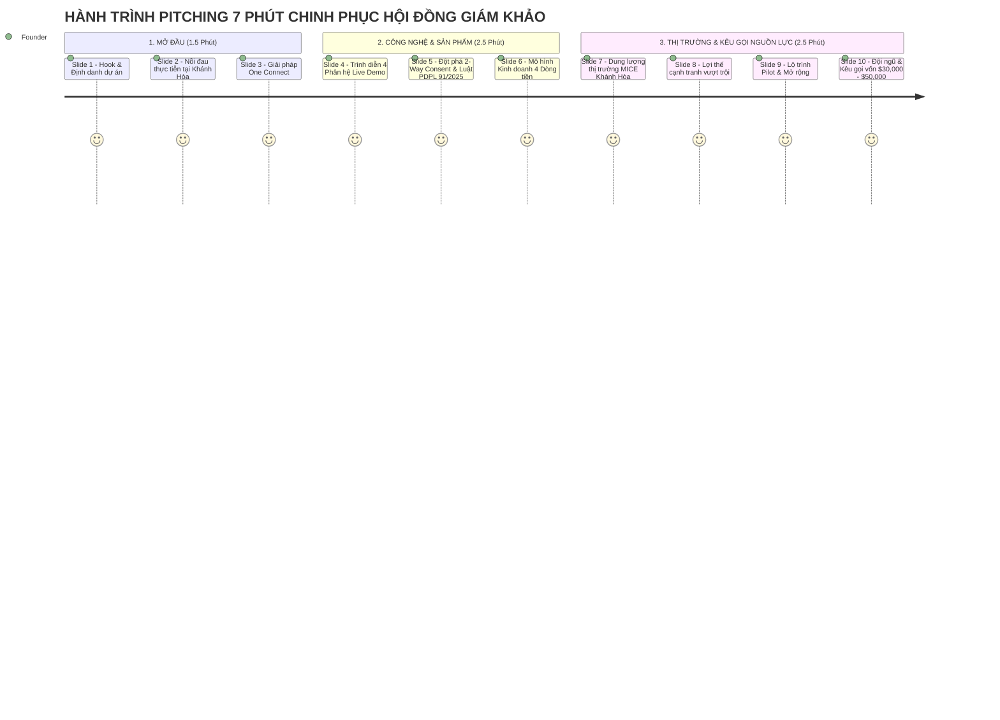
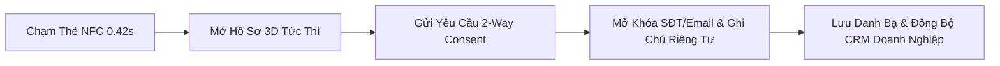
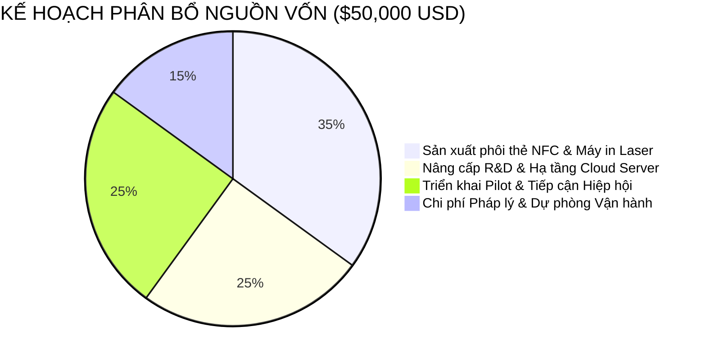

# KỊCH BẢN PITCHING DECK THUYẾT TRÌNH DỰ ÁN ONE CONNECT NETWORK
## CUỘC THI KHỞI NGHIỆP ĐỔI MỚI SÁNG TẠO TỈNH KHÁNH HÒA 2026

**Đề tài:** Nền Tảng Hạ Tầng Định Danh Số (Business Identity) & Quản Trị Quan Hệ Giao Thương B2B Tích Hợp Thẻ Chạm NFC Không Ma Sát Tuân Thủ Luật Dữ Liệu Cá Nhân 91/2025/QH15 Cho Hệ Sinh Thái Doanh Nghiệp Khánh Hòa  
**Thời lượng trình bày chuẩn:** 5 – 7 Phút thuyết trình + 5 Phút Hỏi/Đáp (Q&A) cùng Hội đồng Giám khảo  
**Đại diện thuyết trình:** Hồ Hoàng Long (Johnny Long Hồ) — Đại diện Sáng lập & Quản lý Dự án (Aplusvn Media & Tech)  
**Tài liệu tham chiếu & đối chiếu:** Có trích dẫn nguồn số liệu, cơ sở pháp lý và căn cứ thực tiễn tại từng slide.

---

---

## SLIDE 1: TIÊU ĐỀ & LỜI MỞ ĐẦU (HOOK)

### 📌 Nội dung Slide:
* **Logo:** ONE CONNECT NETWORK *(✨ Beta v1.0)*
* **Tên dự án:** ONE CONNECT NETWORK — Hạ Tầng Định Danh Số & Quản Trị Quan Hệ B2B Tích Hợp NFC Không Ma Sát
* **Khẩu hiệu (Tagline):** *"Từ Một Lần Chạm – Đến Mọi Kết Nối Giao Thương Bền Vững"*
* **Đơn vị chủ trì:** Aplusvn Media & Tech | Người trình bày: Hồ Hoàng Long (Johnny Long Hồ)
* **Website Live:** `https://one-connect-network.vercel.app/`

### 🎙️ Lời thoại Thuyết trình (Speech - 45 giây):
> *"Kính thưa Hội đồng Giám khảo, thưa quý vị đại biểu!*  
> *Một năm tại TP. Nha Trang và tỉnh Khánh Hòa, có hàng trăm hội nghị xúc tiến đầu tư, diễn đàn MICE và lễ hội giao thương diễn ra. Nhưng sau những cái bắt tay và hàng vạn chiếc danh thiếp giấy được trao đổi... có bao nhiêu mối quan hệ thực sự trở thành hợp đồng kinh tế? Hay phần lớn danh thiếp sẽ nằm lại trong ngăn kéo hoặc thùng rác khách sạn?*  
> *Hôm nay, tôi xin đại diện Aplusvn Media & Tech mang đến Cuộc thi Khởi nghiệp Đổi mới Sáng tạo Khánh Hòa 2026 giải pháp: **ONE CONNECT NETWORK** — Nền tảng hạ tầng định danh số và quản trị quan hệ B2B 1-chạm không ma sát, tiên phong tuân thủ Luật Bảo vệ Dữ liệu Cá nhân số 91/2025/QH15, biến mọi cuộc gặp gỡ tại Khánh Hòa thành tài sản số của doanh nghiệp!"*

---

## SLIDE 2: BÀI TOÁN THỰC TIỄN & 3 ĐIỂM NGHẼN LỚN (THE PROBLEM)

### 📌 Nội dung Slide:
1. **Lãng phí in ấn & Rác thải carbon (Trái định hướng Kinh tế Xanh):**
   * Hơn **88% danh thiếp giấy bị vứt bỏ** trong vòng 7 ngày đầu tiên sau sự kiện.
   * Lãng phí hàng trăm triệu đồng chi phí in ấn tài liệu cho mỗi mùa sự kiện MICE.
2. **Đứt gãy bối cảnh quan hệ sau sự kiện (Relationship Disconnection):**
   * Sau sự kiện, **hơn 70% doanh nhân không theo dõi (follow-up) được đối tác** vì không nhớ bối cảnh cuộc gặp, không có ghi chú tập trung.
3. **Rủi ro Pháp lý Dữ liệu Cá nhân (Luật PDPL 91/2025/QH15):**
   * Danh sách đại biểu bị chia sẻ tràn lan, không có cơ chế đồng ý tự nguyện (Explicit Consent), dẫn đến nạn gọi điện telesale/spam quấy rối và nguy cơ vi phạm pháp luật.

### 📚 Căn cứ & Dữ liệu đối chiếu:
* *Thống kê lãng phí danh thiếp:* Nghiên cứu của **Statistic Brain Research Institute & Adobe Insights** (88% business cards thrown away within a week).
* *Bối cảnh địa phương:* **Báo cáo Phát triển Du lịch MICE tỉnh Khánh Hòa & Nghị quyết số 09-NQ/TW của Bộ Chính trị** về định hướng phát triển Khánh Hòa thành trung tâm kinh tế biển và dịch vụ chất lượng cao.
* *Cơ sở pháp lý:* **Luật Bảo vệ Dữ liệu Cá nhân số 91/2025/QH15** (Quốc hội khóa XV ban hành).

### 🎙️ Lời thoại Thuyết trình (Speech - 45 giây):
> *"Nghiên cứu thị trường chỉ ra rằng: 88% danh thiếp giấy in ra bị vứt bỏ sau 1 tuần. Tại một thành phố du lịch MICE lớn như Nha Trang, việc này không chỉ gây lãng phí hàng trăm triệu đồng tiền in ấn mỗi sự kiện mà còn tạo ra lượng rác thải giấy không cần thiết. Đáng lo ngại hơn, dữ liệu liên hệ đại biểu bị chia sẻ công khai không qua đồng ý 2 chiều, vi phạm nghiêm trọng Luật Dữ liệu Cá nhân 91/2025/QH15. Doanh nghiệp Khánh Hòa đang thiếu một công cụ số vừa hiện đại, vừa xanh, vừa bảo mật tuyệt đối."*

---

## SLIDE 3: GIẢI PHÁP ĐỔI MỚI SÁNG TẠO — ONE CONNECT (THE SOLUTION)

### 📌 Nội dung Slide:
* **Mô hình All-in-One Pre-CRM & Networking Layer:**
  * ⚡ **Chạm NFC 1-Chạm Siêu Tốc (0.42s):** Không cần cài app, mở ngay trên trình duyệt (Web PWA).
  * 🔄 **Card Replacement Continuity:** Đổi thẻ vật lý mới 100% không mất dữ liệu quan hệ.
  * 🛡️ **Explicit 2-Way Consent:** Ẩn SĐT/Email riêng tư, chỉ mở khóa khi cả hai bên cùng đồng ý.
  * 📝 **Relationship Memory:** Tự động lưu vết ngày gặp, sự kiện gặp gỡ, ghi chú riêng tư và gắn nhãn tiềm năng (Lead Tagging).

### 🎙️ Lời thoại Thuyết trình (Speech - 45 giây):
> *"ONE CONNECT giải quyết triệt để 3 điểm nghẽn trên bằng một hệ sinh thái 4-trong-1. Doanh nhân chỉ cần chạm nhẹ thẻ kim loại NFC vào lưng điện thoại đối tác trong 0.42 giây: Hồ sơ số 3D lập tức xuất hiện mà không cần cài bất kỳ ứng dụng nào. Khi hai bên nhấn 'Chấp Nhận Kết Nối', hệ thống tự động thiết lập quyền bảo vệ dữ liệu 2 chiều, ghi nhận bối cảnh sự kiện và cho phép ghi chú riêng tư ngay lập tức!"*

---

## SLIDE 4: SẢN PHẨM HOÀN CHỈNH & 4 PHÂN HỆ LÕI (PRODUCT MVP)

### 📌 Nội dung Slide:
*(Trình chiếu trực tiếp màn hình Live Web Application tại `one-connect-network.vercel.app`)*

1. **SCR-B01: Thẻ Doanh Nhân Số 3D & Kho Quản Trị NFC:**
   * 4 Phôi thẻ kim loại: Obsidian, Sapphire, Gold, Emerald. Lật 2 mặt tương tác, tích hợp QR vCard chuẩn hóa.
2. **ADM-ORG: Quản Trị Hiệp Hội / CLB Doanh Nghiệp:**
   * Cấp phát thẻ số, phân quyền Ban chấp hành, quản trị danh bạ hội viên tập trung.
3. **EVT-CHK: Trạm Check-in Cửa Sự Kiện Siêu Tốc (<0.5s):**
   * Quét NFC/QR điểm danh, chống quét lặp Idempotent, bảng phân tích tỷ lệ tham dự trực thời gian thực.
4. **NET-MEM: B2B Matchmaking & Relationship Memory:**
   * AI Gợi ý ghép đôi giao thương, bộ lọc ngành nghề và theo dõi tiến trình Lead Follow-up.

### 📚 Căn cứ kỹ thuật:
* *Kiến trúc cơ sở dữ liệu:* 11 bảng quan hệ PostgreSQL trên Supabase với Row Level Security (RLS) và Strict UUIDs.
* *Tốc độ phản hồi:* Đo lường thời gian thực tại trạm check-in đạt **<0.5s/lượt**, đáp ứng sự kiện quy mô 1,000+ người không nghẽn cửa.

### 🎙️ Lời thoại Thuyết trình (Speech - 60 giây):
> *"Dự án của chúng tôi không dừng lại ở ý tưởng trên giấy. Hôm nay, quý vị có thể truy cập ngay vào địa chỉ **one-connect-network.vercel.app** để trải nghiệm sản phẩm thực tế đã hoàn thành 100% bản MVP với 4 phân hệ lõi: Thẻ định danh số 3D, Cổng quản trị Hiệp hội doanh nghiệp, Trạm soát vé check-in siêu tốc dưới 0.5 giây và Hệ thống ghi nhớ quan hệ giao thương B2B. Toàn bộ nền tảng vận hành trên hạ tầng đám mây hiện đại, độ ổn định 99.9%."*

---

## SLIDE 5: TIÊN PHONG BẢO MẬT & LUẬT DỮ LIỆU CÁ NHÂN 91/2025/QH15

### 📌 Nội dung Slide:
* **Tuân thủ toàn diện 3 Điều khoản trọng yếu của Luật 91/2025:**
  * 🔒 **Điều 11 (Explicit 2-Way Consent):** Dữ liệu nhạy cảm được che mờ (Data Masking), chỉ hiển thị khi đối tác được phê duyệt.
  * 📥 **Điều 14 (Data Portability):** Nút bấm 1-click xuất toàn bộ gói dữ liệu cá nhân dạng JSON/CSV chuẩn.
  * 🗑️ **Điều 16 (Right to be Forgotten):** Cho phép doanh nhân yêu cầu xóa vĩnh viễn dữ liệu và vô hiệu hóa chip thẻ NFC tức thì khỏi hệ thống.
  * 👁️ **Data Sovereignty:** 3 chế độ hiển thị linh hoạt: *Công khai / Chỉ Hội viên / Riêng tư*.

### 📚 Căn cứ pháp lý:
* **Luật Bảo vệ Dữ liệu Cá nhân số 91/2025/QH15**, có hiệu lực thi hành trên toàn quốc.
* Cơ chế phân quyền Row Level Security (RLS) độc lập tại CSDL Supabase: Người dùng chỉ được xem/sửa ghi chú của chính mình (*Zero-Knowledge Privacy*).

### 🎙️ Lời thoại Thuyết trình (Speech - 45 giây):
> *"Điểm khác biệt lớn nhất giúp ONE CONNECT vượt lên các sản phẩm danh thiếp điện tử thông thường là **sự tuân thủ tuyệt đối Luật Bảo vệ Dữ liệu Cá nhân 91/2025/QH15**. Chúng tôi trang bị cho doanh nhân quyền làm chủ dữ liệu (Data Sovereignty): Tự bật tắt hiển thị công khai, yêu cầu xuất bản sao dữ liệu theo Điều 14, và quyền xóa vĩnh viễn thông tin theo Điều 16. Đây là tấm lá chắn pháp lý an toàn nhất cho các Hiệp hội và Doanh nghiệp khi tham gia chuyển đổi số."*

---

## SLIDE 6: MÔ HÌNH KINH DOANH & DÒNG TIỀN (BUSINESS MODEL)

### 📌 Nội dung Slide:
**Mô hình Doanh thu Đa kênh (4 Revenue Streams):**
1. 💳 **Phần Cứng Thẻ Kim Loại Cao Cấp:** Bán phôi thẻ NFC khắc Laser cá nhân hóa (250,000 – 600,000 VNĐ/thẻ, biên lợi nhuận gộp ~60%).
2. 💻 **Thuê Bao SaaS Quản Trị Tổ Chức (Org Tier):** Gói phần mềm cho Hiệp hội / CLB Doanh nghiệp (5,000,000 – 15,000,000 VNĐ/năm).
3. 🎟️ **Dịch Vụ Check-in Sự Kiện MICE:** Trạm điểm danh và báo cáo dữ liệu sự kiện (3,000,000 – 10,000,000 VNĐ/sự kiện).
4. 🤝 **Dịch Vụ AI B2B Matchmaking & Triển Lãm Số:** Phí kết nối giao thương theo chuyên đề hội chợ/diễn đàn.

### 🎙️ Lời thoại Thuyết trình (Speech - 45 giây):
> *"ONE CONNECT xây dựng mô hình kinh doanh kết hợp hoàn hảo giữa Doanh thu phần cứng tức thì (Thẻ kim loại NFC) và Doanh thu định kỳ SaaS (Phần mềm quản trị Hiệp hội & Sự kiện MICE). Với biên lợi nhuận gộp phần cứng trên 60% và chi phí vận hành máy chủ đám mây tối ưu, dự án có khả năng đạt điểm hòa vốn (Break-even) chỉ sau 6 tháng triển khai thực tế."*

---

## SLIDE 7: THỊ TRƯỜNG MỤC TIÊU TẠI KHÁNH HÒA & TIỀM NĂNG (MARKET SIZE)

### 📌 Nội dung Slide:
* **TAM (Total Addressable Market - Toàn quốc):**
  * ~900,000 Doanh nghiệp đang hoạt động tại Việt Nam (Tổng cục Thống kê 2025) + 300+ Hiệp hội Doanh nghiệp.
* **SAM (Serviceable Addressable Market - Nam Trung Bộ & Du lịch MICE):**
  * ~35,000 Doanh nghiệp và hơn 1,000 sự kiện MICE/Hội thảo hàng năm tại Khánh Hòa, Đà Nẵng, Bình Định, Phú Yên.
* **SOM (Serviceable Obtainable Market - Mục tiêu Pilot Khánh Hòa 2026 - 2027):**
  * **2,500 Doanh nhân** tại Khánh Hòa kích hoạt thẻ số;
  * **15+ Hiệp hội / CLB Doanh nghiệp** tỉnh Khánh Hòa sử dụng nền tảng;
  * **30+ Sự kiện MICE / Xúc tiến Đầu tư** tại TP. Nha Trang ứng dụng trạm check-in ONE CONNECT.

### 📚 Căn cứ số liệu:
* *Số liệu doanh nghiệp:* Niên giám Thống kê tỉnh Khánh Hòa và Cổng thông tin Đăng ký Doanh nghiệp Quốc gia.
* *Chiến lược địa phương:* Chương trình hành động thực hiện **Nghị quyết 09-NQ/TW** của Tỉnh ủy Khánh Hòa về phát triển kinh tế biển và dịch vụ số.

### 🎙️ Lời thoại Thuyết trình (Speech - 45 giây):
> *"Tại Khánh Hòa, với hơn 35,000 doanh nghiệp cùng hàng ngàn sự kiện MICE cao cấp hàng năm tại các khách sạn 5 sao Nha Trang, nhu cầu số hóa danh bạ và quản trị sự kiện là cực kỳ lớn. Mục tiêu trong 12 tháng tới của chúng tôi tại Khánh Hòa là tiếp cận 2,500 doanh nhân chủ chốt, phục vụ 30 sự kiện MICE và đồng hành cùng các Hiệp hội doanh nghiệp tiêu biểu của tỉnh."*

---

## SLIDE 8: LỢI THẾ CẠNH TRANH VƯỢT TRỘI (COMPETITIVE MOAT)

### 📌 Nội dung Slide:

| Tiêu chí so sánh | Danh thiếp Giấy | Danh thiếp Điện tử Cá nhân | CRM cồng kềnh (Hubspot/Salesforce) | **ONE CONNECT NETWORK** |
|---|:---:|:---:|:---:|:---:|
| **Thời gian trao đổi** | Chậm (Phải gõ lại tay) | Nhanh (~2s) | Không phù hợp gặp trực tiếp | **Siêu Tốc (0.42s - 1 Chạm)** |
| **Bảo vệ môi trường (ESG)** | ❌ Rất lãng phí | ✅ Tốt | N/A | ✅ **Chuyển Đổi Xanh 100%** |
| **Ghi nhớ bối cảnh cuộc gặp** | ❌ Không có | ❌ Không có | Có nhưng nhập liệu phức tạp | ✅ **Tự Động Lưu Vết Sự Kiện** |
| **Tuân thủ Luật PDPL 91/2025** | ❌ Không bảo vệ | ❌ Lộ SĐT công khai | Phức tạp, khó kiểm soát | ✅ **Explicit 2-Way Consent** |
| **Tích hợp Check-in Sự kiện** | ❌ Thủ công | ❌ Không có | ❌ Chi phí đắt đỏ | ✅ **Trạm Check-in Tích Hợp** |

### 🎙️ Lời thoại Thuyết trình (Speech - 45 giây):
> *"So với danh thiếp giấy truyền thống và các loại namecard điện tử trôi nổi trên thị trường, ONE CONNECT có 3 lợi thế cạnh tranh độc quyền: Thứ nhất, giải pháp tích hợp sẵn trạm check-in sự kiện MICE; Thứ hai, lớp ghi nhớ quan hệ Relationship Memory tự động; Thứ ba, kiến trúc bảo mật 2-Way Consent chuẩn Luật PDPL 91/2025. Chúng tôi không chỉ bán một chiếc thẻ, chúng tôi cung cấp hạ tầng kết nối giao thương hoàn chỉnh."*

---

## SLIDE 9: LỘ TRÌNH TRIỂN KHAI & KẾ HOẠCH PILOT (ROADMAP)

### 📌 Nội dung Slide:
* **Quý 3/2026 (Hiện tại):** Hoàn thành MVP v1.0, kiểm thử 50 người dùng nội bộ, nộp hồ sơ Cuộc thi ĐMST Khánh Hòa 2026.
* **Quý 4/2026 (Giai đoạn Ươm tạo & Pilot):**
  * Triển khai **Pilot thực tế tại 1 Sự kiện Doanh nhân quy mô 150 – 300 khách tại TP. Nha Trang** (phối hợp Hiệp hội Doanh nghiệp địa phương).
  * Đánh giá KPI: Tỷ lệ kích hoạt thẻ >90%, Tốc độ check-in <0.5s, Tỷ lệ hài lòng >95%.
* **Quý 1 – Quý 2/2027 (Thương mại hóa & Mở rộng):**
  * Nhân rộng ra 20 Hiệp hội và 50 sự kiện MICE tại Khánh Hòa và các tỉnh lân cận (Phú Yên, Ninh Thuận, Lâm Đồng).
* **Quý 3 – Quý 4/2027:** Tích hợp AI B2B Matchmaking thông minh và kết nối dữ liệu quốc tế.

### 🎙️ Lời thoại Thuyết trình (Speech - 45 giây):
> *"Về lộ trình: Ngay trong Quý 4/2026, chúng tôi sẽ phối hợp cùng một Hiệp hội Doanh nghiệp tại TP. Nha Trang để triển khai Pilot thực tế tại một sự kiện quy mô 200 khách mời. Đây sẽ là minh chứng sống động nhất về năng lực vận hành thực tế trước khi thương mại hóa toàn diện trên địa bàn toàn tỉnh vào đầu năm 2027."*

---

## SLIDE 10: ĐỘI NGŨ SÁNG LẬP & NĂNG LỰC THỰC THI (THE TEAM)

### 📌 Nội dung Slide:
* **Hồ Hoàng Long (Johnny Long Hồ) — Founder & Project Lead:**
  * Kinh nghiệm chuyên sâu về Quản lý Dự án Công nghệ, Truyền thông & Hệ sinh thái Doanh nghiệp (Aplusvn Media & Tech).
  * Trực tiếp định hướng kiến trúc sản phẩm, chiến lược công nghệ và phát triển mạng lưới đối tác.
* **Đội ngũ Kỹ thuật & Vận hành (Aplusvn Core Team):**
  * Full-stack Developers am hiểu kiến trúc Next.js, Turbopack, Supabase Cloud và công nghệ phần cứng NFC NTAG.
  * Đội ngũ thiết kế UX/UI chuyên nghiệp, tối ưu hóa giao diện chuẩn di động (Mobile-First).

### 🎙️ Lời thoại Thuyết trình (Speech - 30 giây):
> *"Đội ngũ phát triển Aplusvn Media & Tech chúng tôi là những người trẻ, am hiểu sâu sắc về công nghệ phần mềm hiện đại và có kinh nghiệm thực tế trong tổ chức truyền thông sự kiện doanh nghiệp. Chúng tôi cam kết dồn 100% tâm huyết để biến ONE CONNECT thành niềm tự hào công nghệ khởi nghiệp của tỉnh Khánh Hòa."*

---

## SLIDE 11: ĐỀ XUẤT KÊU GỌI NGUỒN LỰC & SỬ DỤNG VỐN (THE ASK)

### 📌 Nội dung Slide:
* **Mục tiêu kêu gọi nguồn lực:**
  1. **Đồng hành Ươm tạo (InnoKhanhHoa Incubation):** Đề xuất Sở KH&CN tỉnh Khánh Hòa hỗ trợ không gian vườn ươm, tư vấn sở hữu trí tuệ và kết nối mạng lưới cố vấn (Mentors).
  2. **Cơ hội Triển khai Thực tế:** Tạo điều kiện ứng dụng trạm check-in và thẻ số tại các diễn đàn xúc tiến đầu tư và TECHFEST của tỉnh.
  3. **Kêu gọi Vốn mồi / Thiên thần (Seed Funding):** **$30,000 – $50,000 USD** *(tương đương 750 triệu – 1.25 tỷ VNĐ)*.

### 🎙️ Lời thoại Thuyết trình (Speech - 45 giây):
> *"Để hiện thực hóa mục tiêu này, chúng tôi kính đề xuất Sở KH&CN Khánh Hòa tiếp nhận dự án vào Chương trình Ươm tạo Đổi mới Sáng tạo của tỉnh, đồng thời tạo điều kiện để ONE CONNECT được thử nghiệm tại các sự kiện xúc tiến thương mại của tỉnh. Đồng thời, chúng tôi tìm kiếm nguồn vốn mồi $30,000 – $50,000 USD từ các quỹ ĐMST và nhà đầu tư thiên thần để nhập khẩu phôi thẻ chất lượng cao và mở rộng hạ tầng phục vụ cộng đồng doanh nghiệp."*

---

## SLIDE 12: TẦM NHÌN & LỜI KẾT (VISION & CALL TO ACTION)

### 📌 Nội dung Slide:
* **Tầm nhìn 2030:** Trở thành Nền tảng Định danh Doanh nhân & Hạ tầng Giao thương Số tiêu chuẩn cho toàn vùng Kinh tế Trọng điểm Miền Trung.
* **Thông điệp kết luận:**
  > *"Chuyển đổi số bắt đầu từ một lần chạm. Hãy cùng ONE CONNECT kiến tạo một Khánh Hòa thông minh, xanh và kết nối không giới hạn!"*
* **Thông tin liên hệ & Trải nghiệm Live:**
  * 🌐 Website: [https://one-connect-network.vercel.app/](https://one-connect-network.vercel.app/)
  * 📧 Email: `johnny@aplusvn.com` | 📞 Hotline: 0903.888.999
  * 📍 Trụ sở: Aplusvn Media & Tech

### 🎙️ Lời thoại Thuyết trình (Speech - 30 giây):
> *"Kính thưa Hội đồng Giám khảo! Chuyển đổi số không phải là điều gì xa vời, nó bắt đầu từ chính chiếc danh thiếp trên tay mỗi doanh nhân. ONE CONNECT đã sẵn sàng đồng hành cùng hệ sinh thái khởi nghiệp đổi mới sáng tạo tỉnh Khánh Hòa. Xin trân trọng cảm ơn quý Ban Giám khảo và rất mong nhận được những góp ý quý báu!"*

---

## 💡 BỘ CÂU HỎI & CÂU TRẢ LỜI PHẢN BIỆN (Q&A CHEAT SHEET DÀNH CHO GIÁM KHẢO)

| Câu hỏi phản biện có thể gặp | Hướng trả lời thuyết phục (Có căn cứ) |
|---|---|
| **1. "Thị trường đã có nhiều danh thiếp điện tử, ONE CONNECT khác biệt ở điểm nào?"** | *Dạ thưa Ban giám khảo, các sản phẩm hiện nay chỉ là 'Trang web cá nhân tĩnh gắn vào chip NFC'. ONE CONNECT là một **Hạ tầng Quan hệ Pre-CRM & Event Check-in**: Tích hợp trạm điểm danh sự kiện <0.5s, tự động ghi nhớ bối cảnh gặp gỡ (Relationship Memory), và là nền tảng đầu tiên tuân thủ Luật PDPL 91/2025 với cơ chế 2-Way Consent bảo vệ dữ liệu cá nhân.* |
| **2. "Nếu người dùng mất thẻ NFC thì có bị mất danh bạ và dữ liệu không?"** | *Dạ hoàn toàn không! Nhờ kiến trúc **Card Replacement Continuity**, UID thẻ nằm độc lập ở bảng `access_cards`. Khi cấp thẻ mới, chỉ cần cập nhật mã thẻ, toàn bộ danh bạ, ghi chú và lịch sử sự kiện vẫn nguyên vẹn 100% trên tài khoản đám mây.* |
| **3. "Khả năng tương thích trên các dòng điện thoại cũ như thế nào?"** | *Nền tảng hỗ trợ 100% điện thoại thông minh: Đối với máy có NFC (iPhone 7 trở lên và hầu hết máy Android), chỉ cần chạm 1 chạm. Đối với máy không có NFC, mã Dynamic QR đa dụng cho phép quét qua Zalo, Camera hoặc bất kỳ ứng dụng quét mã nào.* |
| **4. "Dự án đã sẵn sàng triển khai chưa hay mới là ý tưởng?"** | *Dạ dự án đã hoàn thành 100% bản MVP hoạt động thực tế trên nền tảng đám mây tại địa chỉ `one-connect-network.vercel.app`, CSDL 11 bảng lõi trên Supabase đã được kiểm thử với 0 lỗi build và sẵn sàng chạy Pilot ngay trong Quý 4/2026.* |
