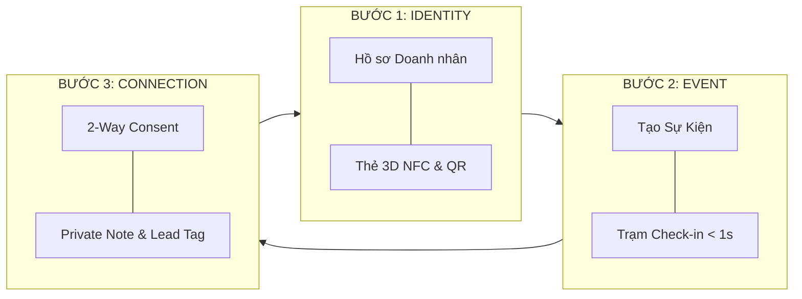

# 🎯 ĐẶC TẢ MVP GIAI ĐOẠN 1: PROTOTYPE IDENTITY ➔ CONNECTION ➔ EVENT
### DỰ ÁN ONE CONNECT — BUSINESS RELATIONSHIP NETWORK
*Phiên bản: MVP Phase 1.0 (Core Prototype Flywheel)*  
*Cập nhật: 2026-08-20*

---

## 🌟 1. MỤC TIÊU CỐT LÕI CỦA GIAI ĐOẠN NÀY (CORE OBJECTIVE)

> **Mục tiêu tối thượng của Phase 1:**  
> Xây dựng và kiểm chứng thành công **Vòng lặp Nguyên mẫu Lõi (Core Prototype Flywheel)** từ **Offline ➔ Online ➔ Relationship Memory** trong 01 sự kiện Pilot thực tế (100–300 người) với 1 Hiệp hội / CLB Doanh nhân đối tác.

---

## 📦 2. PHẠM VI 3 TRỤ CỘT MVP BẮT BUỘC (IN-SCOPE FOR PHASE 1)

### 📱 TRỤ CỘT 1: ĐỊNH DANH DOANH NHÂN & DOANH NGHIỆP (IDENTITY LAYER)
* **Digital Profile (PWA/Web):**
  * Hồ sơ cá nhân: Họ tên, chức vụ, ảnh đại diện, tiểu sử, hotline công vụ, email.
  * Hồ sơ pháp nhân: Tên công ty, ngành nghề kinh doanh, website, mã số thuế, brochure/portfolio năng lực.
* **3D Smart Business Card (NFC + Dynamic QR):**
  * Mô phỏng thẻ 3D tương tác xoay 2 mặt (Chất liệu Obsidian, Sapphire, Gold, Emerald).
  * Mã QR động dẫn thẳng đến `one-connect.vn/p/[username]`.
* **Ma trận Bảo mật Consent (PDPL 91/2025 Compliant):**
  * Tùy chọn 3 cấp độ hiển thị: *Public (Công khai)*, *Business (Công vụ)*, *Confidential (Bảo mật)*.

### 🎪 TRỤ CỘT 2: SỰ KIỆN & CHECK-IN SIÊU TỐC (EVENT & CHECK-IN LAYER)
* **Quản lý Sự kiện cơ bản:**
  * Tạo sự kiện, lịch trình, địa điểm, banner và danh sách đăng ký.
* **Trạm Check-in Tốc độ cao (`< 1 giây`):**
  * Điểm danh qua quét camera QR hoặc chạm NFC.
  * Giao diện Live Terminal với âm thanh xác nhận (*Beep!*), hoạt động mượt mà kể cả khi mất mạng (Offline queueing).
* **Danh sách Điểm danh Thời gian thực (Live Attendance):**
  * Đếm tự động: Đã điểm danh / Chưa điểm danh, danh sách đại biểu có mặt theo bàn / theo hạng vé (VIP/Standard).

### 🤝 TRỤ CỘT 3: KẾT NỐI & BỘ NHỚ QUAN HỆ (CONNECTION & RELATIONSHIP MEMORY)
* **Kết nối 2 chiều có Consent (2-Way Connection):**
  * Quét mã hoặc bấm nút "Kết nối" trên trang cá nhân ➔ Bên nhận nhận thông báo và chấp thuận (Accept).
* **Private Notes (Ghi chú Cuộc gặp Riêng tư):**
  * Cho phép người dùng ghi chú bí mật ngay sau khi gặp: *"Gặp tại Diễn đàn 2026, đối tác cần mua 500 camera AI trong Q4/2026..."*.
* **Lead Qualification Tagging (Phân loại Quan hệ):**
  * Gắn tag nhanh: `NEW` ➔ `WARM` ➔ `HOT` ➔ `CONVERTED`.
  * Gắn nhãn đối tác: *Khách hàng tiềm năng, Nhà cung cấp, Đối tác chiến lược, Bạn bè*.

---

## 🚫 3. NHỮNG TÍNH NĂNG TẠM THỜI ĐÓNG BĂNG (OUT OF SCOPE - DEFERRED)

Để tránh phân tán nguồn lực và không làm loãng MVP, các hạng mục sau **CHƯA XÂY DỰNG TRONG GIAI ĐOẠN 1**:
1. ❌ **Không xây dựng AI Matching nâng cao** (Chỉ dùng bộ lọc Cung - Cầu cơ bản).
2. ❌ **Không xây dựng thuật toán xếp bàn tiệc tự động đa tiêu chí** (Ban tổ chức xếp bàn theo ngành nghề thủ công hoặc bán tự động).
3. ❌ **Không xây dựng hệ thống CRM đa tầng cồng kềnh** (Tập trung vào Pre-CRM: Note & Tag).
4. ❌ **Không tích hợp cổng thanh toán hội phí trực tuyến phức tạp** (Hội thu hội phí qua chuyển khoản ngân hàng truyền thống).
5. ❌ **Không phát triển Native App iOS/Android riêng** (Tận dụng 100% sức mạnh của Responsive Web & PWA).
6. ❌ **Không làm tính năng in ấn thẻ tên vật lý tại chỗ** (Chuyển đổi số 100% qua thiết bị và màn hình điện thoại).

---

## 🧪 4. TIÊU CHÍ NGHIỆM THU PILOT (PILOT ACCEPTANCE CRITERIA)

| Hạng mục | Chỉ số đo lường (KPI Target) | Phương pháp kiểm chứng |
| :--- | :--- | :--- |
| **1. Kích hoạt Identity** | `≥ 70%` đại biểu hoàn thiện Profile trước sự kiện | Thống kê số lượng `person_identities` |
| **2. Tốc độ Check-in** | `< 1.2 giây / người` tại cửa | Đo thời gian phản hồi thực tế tại trạm check-in |
| **3. Độ ổn định Check-in** | `≥ 99.5%` không bị gián đoạn / treo hệ thống | Nhật ký kiểm toán `check_ins` |
| **4. Kết nối sau Sự kiện** | `≥ 35%` đại biểu tạo ít nhất 01 kết nối + 01 Private Note | Thống kê số lượng `connections` và `notes` |
| **5. Đánh giá Lãnh đạo Hội** | `NPS ≥ 60` (Ban Chấp Hành hài lòng và muốn dùng tiếp) | Phỏng vấn đánh giá sau sự kiện |

---

*Bản đặc tả MVP Phase 1 được khóa và dùng làm cơ sở nghiệm thu kỹ thuật và vận hành Pilot.*
