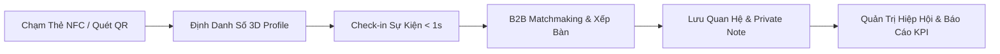
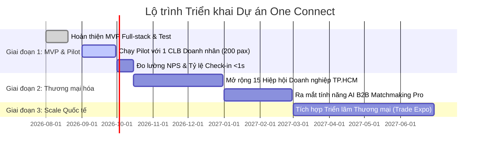

# 📑 HỒ SƠ PHÂN TÍCH TỔNG HỢP DỰ ÁN ONE CONNECT
### BẢN ĐẶC TẢ CHIẾN LƯỢC, MÔ HÌNH KINH DOANH & KHUNG THAM VẤN CHUYÊN GIA (EXPERT EVALUATION DOSSIER)

---

## 🌟 1. TÓM TẮT ĐIỀU HÀNH (EXECUTIVE SUMMARY)

* **Tên dự án:** **ONE CONNECT** (One Connect Network)
* **Khẩu hiệu (Tagline):** *Nền tảng Định danh Doanh nhân & Quản trị Mạng lưới B2B Toàn diện (Physical Touch • Digital Memory • Enterprise Trust)*.
* **Định vị Sản phẩm (Positioning):** Lớp hạ tầng phần mềm **SaaS B2B** kết hợp cổng truy cập vật lý **NFC & Dynamic QR**, giải quyết trọn vẹn chu trình kết nối: **Định danh số ➔ Check-in sự kiện siêu tốc ➔ AI Matchmaking ➔ Ghi nhớ quan hệ (Relationship Memory) ➔ Quản trị cộng đồng Hiệp hội doanh nghiệp**.
* **Tuân thủ Pháp lý:** Thiết kế tuân thủ nghiêm ngặt **Luật Bảo vệ Dữ liệu Cá nhân (PDPL 91/2025/QH15)** và **Nghị định 13/2023/NĐ-CP** với cơ chế Đồng thuận 2 chiều (2-Way Explicit Consent).



---

## 🚨 2. BỐI CẢNH THỊ TRƯỜNG & 4 NỖI ĐAU LỚN (PROBLEM STATEMENT)

### 2.1. Đứt gãy kết nối sau sự kiện (The Post-Event Networking Gap)
* **Thực trạng:** Phần lớn danh thiếp giấy trao tay tại các hội thảo và sự kiện giao thương nhanh chóng bị thất lạc hoặc lãng quên do tính chất tĩnh, không thể cập nhật khi có thay đổi chức vụ hay pháp nhân.
* **Hậu quả:** Doanh nhân thiếu công cụ ghi nhớ bối cảnh cuộc gặp (gặp ở đâu, nhu cầu Cung - Cầu là gì, lịch sử tương tác), dẫn đến tỷ lệ chuyển đổi và cơ hội hợp tác sau sự kiện rất thấp.

### 2.2. Điểm nghẽn Check-in & Rác thải sự kiện (Event Check-in Bottleneck)
* **Thực trạng:** Khâu đón tiếp và điểm danh đại biểu tại các sự kiện quy mô vừa và lớn thường gặp tình trạng tắc nghẽn cục bộ tại khung giờ cao điểm do thủ tục dò tìm danh sách thủ công, gây áp lực lớn cho ban tổ chức.
* **Lãng phí:** Hàng ngàn dây đeo và thẻ giấy dùng một lần gây lãng phí ngân sách và không phù hợp với xu hướng chuyển đổi xanh (Green Event / ESG).

### 2.3. Hiệp hội Doanh nghiệp thiếu công cụ số hóa (Fragmented Association Management)
* **Thực trạng:** Các Hiệp hội, CLB Doanh nghiệp (như BNI, YBA, CLB Doanh nhân Sài Gòn, Hội Doanh nhân Trẻ...) quản lý danh bạ hội viên bằng file bảng tính rời rạc, thiếu công cụ đo lường mức độ tương tác thực tế và khó chứng minh giá trị ROI kết nối mang lại cho hội viên.

### 2.4. Yêu cầu Quản trị Dữ liệu & Quyền riêng tư (Trust & Compliance Layer)
* **Thực trạng & Bối cảnh Pháp lý:** Trong bối cảnh Luật Bảo vệ Dữ liệu Cá nhân số 91/2025/QH15 và Nghị định 13/2023/NĐ-CP được thực thi, việc thu thập, số hóa và chia sẻ dữ liệu liên lạc đòi hỏi tính minh bạch và cơ chế đồng thuận (Consent-by-Design). One Connect giải quyết bài toán này bằng ma trận phân quyền chia sẻ dữ liệu có kiểm soát, giúp cá nhân và tổ chức tự tin kết nối mà vẫn bảo vệ quyền riêng tư.

---

## 🏗️ 3. KIẾN TRÚC GIẢI PHÁP: 3 PHÂN HỆ LÕI (THE 3-MODULE ECOSYSTEM)

One Connect được cấu trúc thành **3 phân hệ độc lập nhưng liên thông dữ liệu hoàn hảo**:

```
+---------------------------------------------------------------------------------------+
|                                  ONE CONNECT PLATFORM                                 |
+------------------------------------+--------------------------------------------------+
| 📱 MODULE 1: DOANH NHÂN & B2B      | 💳 Thẻ thông minh 3D NFC (Obsidian/Sapphire/Gold) |
|    (Personal & Business Identity)  | 🤝 Mạng lưới B2B, Ghi chú riêng tư (Private Note)|
|                                    | 🛡️ 3 Cấp độ bảo mật Consent (PDPL 91/2025)       |
+------------------------------------+--------------------------------------------------+
| 🎪 MODULE 2: QUẢN LÝ EVENT         | ⚡ Trạm Check-in siêu tốc <1s (NFC / Live QR)    |
|    (Event Ops & Attendance Hub)    | 📊 Danh sách điểm danh & Đồng bộ thời gian thực  |
|                                    | 🎯 B2B Matchmaking & Xếp bàn kết nối giao thương|
+------------------------------------+--------------------------------------------------+
| 🏢 MODULE 3: QUẢN TRỊ HIỆP HỘI     | 🏛️ Hồ sơ Pháp nhân Doanh nghiệp & Đại biểu      |
|    (Association & Community CRM)  | 👥 Danh bạ Doanh nhân & Theo dõi Đóng hội phí   |
|                                    | 📈 Báo cáo Đo lường KPI Tương tác & Webhooks     |
+------------------------------------+--------------------------------------------------+
```

### Chi tiết từng phân hệ:

#### 📱 Module 1: Doanh Nhân & B2B (Personal & Business Identity)
* **Thẻ Định Danh Số 3D:** Hiển thị 2 mặt thông minh (Mặt trước: Chân dung, chức danh, công ty, mã định danh; Mặt sau: QR động, liên kết website, email, hotline).
* **Quản lý Thẻ NFC Độc Lập:** Cho phép gán/hủy/cấp lại thẻ NFC vật lý mà không làm mất lịch sử mạng lưới quan hệ đã kết nối.
* **3 Cấp độ Chia sẻ Dữ liệu (Privacy Consent Matrix):**
  1. *Public:* Họ tên, chức vụ, tên công ty, lĩnh vực kinh doanh.
  2. *Business:* Số điện thoại công vụ, Email doanh nghiệp, Profile năng lực.
  3. *Confidential:* Doanh thu, nhu cầu gọi vốn/M&A, liên hệ cá nhân (chỉ hiển thị khi 2 bên cùng Accept).

#### 🎪 Module 2: Quản Lý & Vận Hành Sự Kiện (Event Hub & Live Attendance)
* **Trạm Check-in Tốc Độ Cao:** Hỗ trợ quét 1 chạm qua thẻ NFC hoặc camera QR với tốc độ xử lý `< 1 giây/người`, vận hành ổn định cả khi mất mạng (Offline Queueing & Sync).
* **Loại bỏ in thẻ tên truyền thống:** Chuyển đổi sang điểm danh số hóa 100%, gửi thông báo chào mừng tự động qua Zalo OA / SMS.
* **B2B Matchmaking Thông Minh:** Thuật toán tự động ghép đôi doanh nghiệp theo ma trận Cung (Supply) - Cầu (Demand) và chỉ định vị trí bàn tiệc / phiên giao thương tương ứng.

#### 🏢 Module 3: Quản Trị Hiệp Hội & CLB Doanh Nghiệp (Organization Management)
* **Cơ cấu Tổ chức Đa cấp:** Quản lý Ban Chấp Hành, Hội viên Chính thức, Hội viên Liên kết, Khách mời.
* **Báo Cáo Đo Lường KPI Thực Chất:** Thống kê tỷ lệ tham gia sinh hoạt định kỳ, tổng số lượt chạm kết nối B2B trong hội, giá trị giao thương tiềm năng.
* **Tự động hóa & Webhook:** Tích hợp với hệ thống CRM doanh nghiệp, phần mềm kế toán và công cụ gửi tin nhắn tự động.

---

## ⚔️ 4. PHÂN TÍCH ĐỐI THỦ & LỢI THẾ CẠNH TRANH (COMPETITIVE ADVANTAGE)

| Tiêu chí | Danh thiếp Giấy | Linktree / Bio-link | Popl / Dot Cards | Phần mềm Event (Eventbrite...) | **ONE CONNECT** |
| :--- | :---: | :---: | :---: | :---: | :---: |
| **Giao diện vật lý** | Giấy in | Không có | Thẻ NFC cá nhân | Vé QR giấy / App | **Thẻ NFC Kim loại/PVC + QR** |
| **Định danh Doanh nghiệp B2B** | Tĩnh, dễ mất | Cơ bản | Cá nhân đơn lẻ | Không có | **Hồ sơ Pháp nhân 3 cấp độ** |
| **Tốc độ Check-in Sự kiện** | > 30s (Thủ công) | Không có | Không có | 3 - 5s (Cần app) | **< 1s (Chạm NFC / Live QR)** |
| **B2B Matchmaking & Xếp bàn** | Thủ công | Không có | Không có | Hạn chế | **Tự động theo Cung - Cầu** |
| **Quản trị Hội viên Hiệp hội** | Sổ sách / Excel | Không có | Không có | Không có | **Chuyên sâu cho Hội/CLB** |
| **Tuân thủ PDPL 91/2025** | Rủi ro cao | Không rõ ràng | Chuẩn Mỹ (CCPA) | Cơ bản | **Bảo mật 2-Way Consent** |

### Lợi thế phòng thủ (Moat):
1. **Hiệu ứng Mạng lưới 2 chiều (Network Effects):** Càng nhiều Hội viên tham gia One Connect, giá trị kết nối của từng thành viên càng tăng theo cấp số nhân.
2. **Khóa dữ liệu quan hệ (Relationship Lock-in):** Khi doanh nhân đã lưu trữ hàng trăm ghi chú cuộc gặp (Notes), lịch sử gặp gỡ tại các sự kiện trên One Connect, chi phí chuyển đổi (Switching Cost) sang nền tảng khác là rất cao.
3. **Mô hình Doanh nghiệp vào Doanh nghiệp (B2B2C):** Tiếp cận trực tiếp Ban lãnh đạo Hiệp hội để triển khai đồng loạt cho 200 - 500 hội viên trong 1 hợp đồng, giảm thiểu chi phí tìm kiếm khách hàng (CAC).

---

## 💰 5. MÔ HÌNH KINH DOANH & KẾ HOẠCH DOANH THU (BUSINESS & REVENUE MODEL)

One Connect áp dụng mô hình **Hybrid (Hardware-enabled SaaS)** với 4 nguồn thu vững chắc:

```
[ DOANH THU ONE CONNECT ]
 ├── 1. Bán Phần Cứng (Hardware Sales): Thẻ NFC Doanh nhân, Thẻ NFC Ban điều hành, Trạm Tap Terminal.
 ├── 2. Phí Đăng ký SaaS Cá nhân (B2B Pro Subscription): Nâng cấp tính năng AI Matching, Không giới hạn danh bạ.
 ├── 3. Phí Vận Hành Sự Kiện (Event Licensing): Gói check-in theo sự kiện (Ví dụ: 3.000.000đ - 15.000.000đ/event).
 └── 4. Thuê bao Hiệp hội Doanh nghiệp (Association Annual Plan): Thu phí thường niên theo quy mô Hội/CLB.
```

### Dự phóng Doanh thu theo Gói Sản phẩm:
1. **Gói Thẻ Doanh Nhân One Card:**
   * Thẻ PVC Cao Cấp: 250.000đ - 350.000đ / thẻ.
   * Thẻ Kim Loại Khắc Laser (Titanium/Matte Black): 650.000đ - 1.200.000đ / thẻ.
2. **Gói Sự Kiện (Event Tier):**
   * *Event Basic (<150 khách):* 2.500.000đ / sự kiện (Bao gồm hệ thống check-in & báo cáo).
   * *Event Pro (150 - 500 khách):* 6.000.000đ / sự kiện (Check-in NFC, B2B Matchmaking, Xếp bàn tự động).
   * *Summit / Expo (>1.000 khách):* 15.000.000đ - 35.000.000đ / sự kiện.
3. **Gói Hiệp Hội & Câu Lạc Bộ (Association Tier):**
   * *CLB Tiêu chuẩn (<100 hội viên):* 12.000.000đ / năm.
   * *Hiệp hội Lớn (100 - 500 hội viên):* 24.000.000đ - 48.000.000đ / năm.

---

## 🛠️ 6. KIẾN TRÚC CÔNG NGHỆ & TÍNH KHẢ THI (TECHNICAL FEASIBILITY)

* **Front-end Stack:** Next.js 16 (App Router, Turbopack), React 19, TypeScript, Vanilla CSS + TailwindCSS Tokens.
* **Trải nghiệm Thiết bị (Cross-platform PWA):** Hoạt động mượt mà trên iOS Safari và Android Chrome không cần cài đặt App từ kho ứng dụng (Zero-friction onboarding).
* **Cơ sở Dữ liệu & Back-end:** PostgreSQL (Prisma ORM) gồm 11 bảng chuẩn hóa quan hệ (`users`, `businesses`, `cards`, `organizations`, `memberships`, `events`, `registrations`, `check_ins`, `connections`, `notes`, `leads`).
* **Bảo mật & Kiểm toán:** Phân quyền vai trò nghiêm ngặt (**RBAC Matrix**: `SUPER_ADMIN`, `ORG_ADMIN`, `EVENT_OPERATOR`, `MEMBER`, `GUEST`). Mã hóa dữ liệu lưu trữ và truyền tải.

---

## 🎯 7. LỘ TRÌNH TRIỂN KHAI PILOT (GO-TO-MARKET & PILOT ROADMAP)



### Chỉ số Đo lường Thành công trong Pilot (Pilot KPIs):
* **Tỷ lệ Check-in Thành công Lần đầu:** `> 98%` qua NFC/QR.
* **Thời gian Xử lý Check-in Trung bình:** `< 1.2 giây / đại biểu`.
* **Tỷ lệ Hội viên Kích hoạt & Trao đổi Danh bạ Số:** `> 75%` đại biểu tham dự.
* **Điểm Đánh giá Trải nghiệm Người dùng (NPS):** `> 65 điểm`.

---

## ❓ 8. KHUNG CÂU HỎI THAM VẤN DÀNH CHO CHUYÊN GIA (EXPERT CRITIQUE FRAMEWORK)

*Khi gửi tài liệu này cho các Chuyên gia (Product Director, VC Investor, Giám đốc Hiệp hội, Chuyên gia Công nghệ), bạn có thể đề nghị họ đánh giá tập trung vào 4 nhóm câu hỏi sau:*

### 📌 Nhóm 1: Về Tính Phù Hợp Thị Trường (Product-Market Fit)
1. Theo Chuyên gia, nỗi đau về *"Mất liên lạc sau sự kiện & Quản lý hội viên rời rạc"* có đủ lớn để các Ban Chấp Hành Hiệp hội sẵn sàng chi trả ngân sách năm hay không?
2. Việc tích hợp **Cơ chế Đồng thuận 2 chiều (PDPL 91/2025)** có tạo nên lợi thế bán hàng độc nhất (USP) so với các giải pháp bio-link quốc tế không?

### 📌 Nhóm 2: Về Mô Hình Kinh Doanh & Định Giá (Pricing & Unit Economics)
1. Cơ cấu định giá kết hợp giữa **Phần cứng (Thẻ NFC)** và **Phần mềm (SaaS thường niên)** như trên đã tối ưu dòng tiền giai đoạn đầu chưa?
2. Đâu là rào cản lớn nhất khi thuyết phục các Event Agency / Ban tổ chức sự kiện chuyển từ in thẻ đeo giấy sang Trạm Check-in số của One Connect?

### 📌 Nhóm 3: Về Chiến Lược Thâm Nhập (Go-To-Market Strategy)
1. Chiến lược tiếp cận **B2B2C** (Đánh qua Chủ tịch/Tổng thư ký các Hội Doanh nhân trước để kéo toàn bộ Hội viên vào) có phải là con đường nhanh nhất để đạt 10.000 người dùng đầu tiên?
2. Có nên cung cấp phiên bản miễn phí (Freemium) cho sự kiện nội bộ dưới 50 người để tạo độ phủ thương hiệu?

### 📌 Nhóm 4: Về Rủi Ro & Lỗ Hổng Cần Phòng Ngừa (Risks & Vulnerabilities)
1. Nếu một đối thủ sao chép làm thẻ NFC giá rẻ, One Connect cần củng cố rào cản phòng thủ công nghệ nào (AI Matchmaking, Cơ sở dữ liệu B2B Verified, hay Tích hợp ERP)?
2. Thách thức lớn nhất về mặt tâm lý người dùng khi chạm thẻ NFC tại Việt Nam là gì và làm thế nào để đào tạo thị trường nhanh nhất?

---

*Tài liệu được biên soạn và chuẩn hóa phục vụ thẩm định đầu tư & đánh giá chiến lược sản phẩm.*
